# 1、创建应用

##  1.1 应用探索

 在【应用市场】&【应用启动器】可以看到平台提供的热门应用，无需自己搭建环境，支持一键启动快速部署。根据左侧的类型筛选或者关键词搜索，可查找您感兴趣的应用。


 在右侧应用卡片上，将展示该应用的基础信息包括名称、类型标签和其他标签、应用使用的深度学习框架、提供者、更新时间、应用描述等信息，帮助您快速了解应用。点击应用，进入应用详情页，您可以查看该应用的具体介绍。应用提供者将在此处介绍具体的应用场景、功能描述、技术方法、模型训练与使用还有效果评估，供您参考。

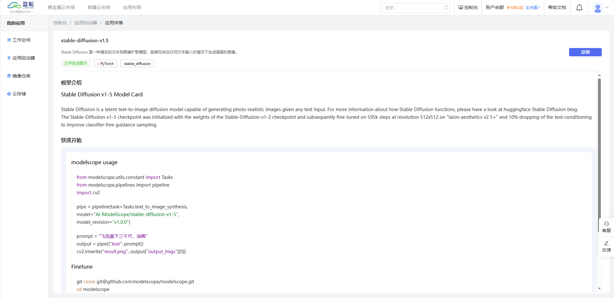

##  1.2 部署应用

 选择应用部署所需要的GPU卡。依次选择计费方式、GPU型号以及对应的卡数，如果您选择卡券，将按照选择卡券的顺序进行扣费。

 点击「部署」按钮，即可进行环境配置。

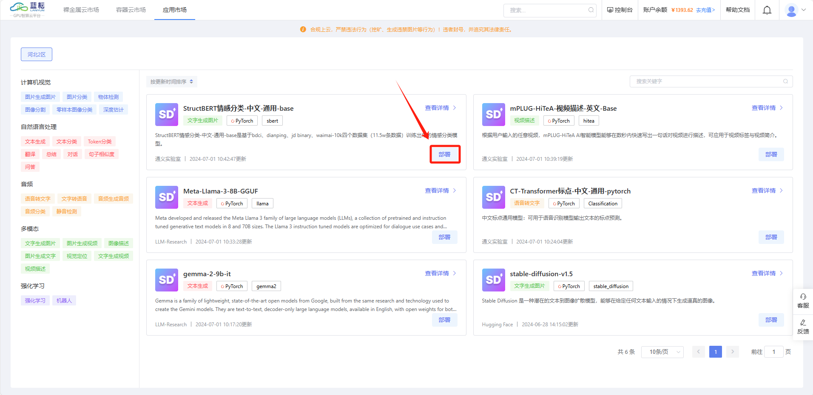

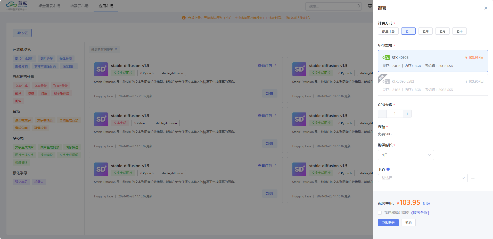

# 2、使用应用

进入【工作空间】模块，使用我们已经部署好的应用。点击【控制台】-【我的应用】-【应用实例】，进入应用部署搭建的应用实例模块。


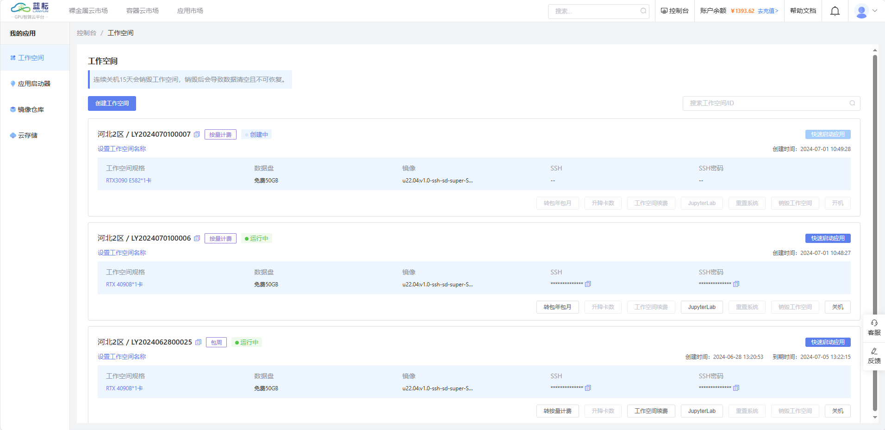

## 2.1 快速启动应用

在开机状态下，所有应用均支持一键启动，点击「快速启动应用」，将会打开新的浏览器页面显示正在运行的应用，用户根据自己需要进行尝试。以stable-diffusion-v1.5应用为例，如下图


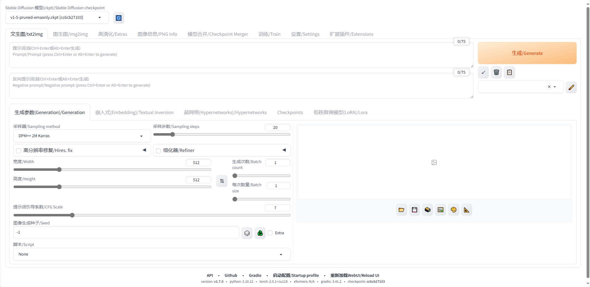

## 2.2 开关机

对于按量计费的实例，关机之后将停止计费，同时GPU卡会被放入云市场中。如果该类型卡数被全部抢占，您可以通过数据迁移、克隆实例将数据迁移至新实例中。在实例关机后，我们将会为您保留15天的数据。

对于包年包月模式的实例，实例到期之后我们将会为您保留15天的数据，如果您想继续使用，可以直接开机，将会按照按量计费的方式收费；您也可以续费，选择所需时长使用。

## 2.3 SSH登录

口令登录

第一步：打开Xshell或者本地的Powershell或终端。复制SSH，粘贴到Xshell或者本地的Powershell或终端；

第二步：复制SSH密码，右击可粘贴密码，点击enter可链接实例

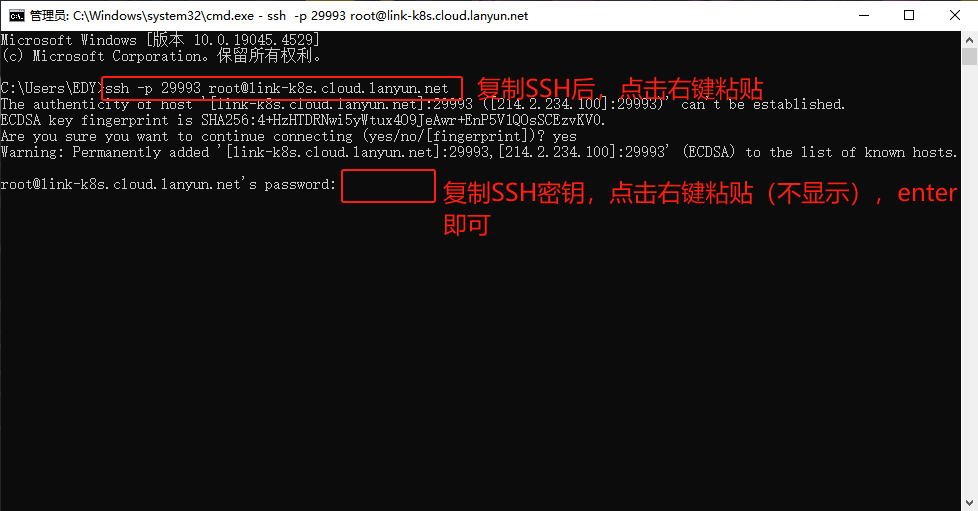

## 2.4 JupyterLab

整体操作界面如下，右侧为内容展示区域，左栏主要为文件管理和各类功能键

> ⚠️请注意，JupyterLab 的工作目录设置为 `/root` 目录，这与系统的根目录 `/` 不同。

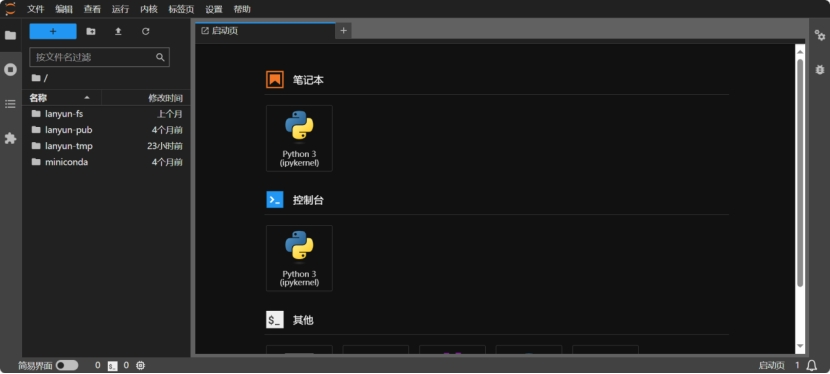

当您使用Notebook运行程序后，如果过了一段时间发现日志没有新的更新，这时可以利用“日志控制台”来查看最新的日志。下面将演示如何操作：


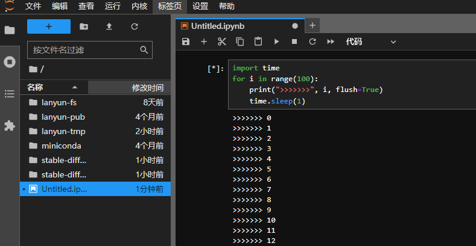

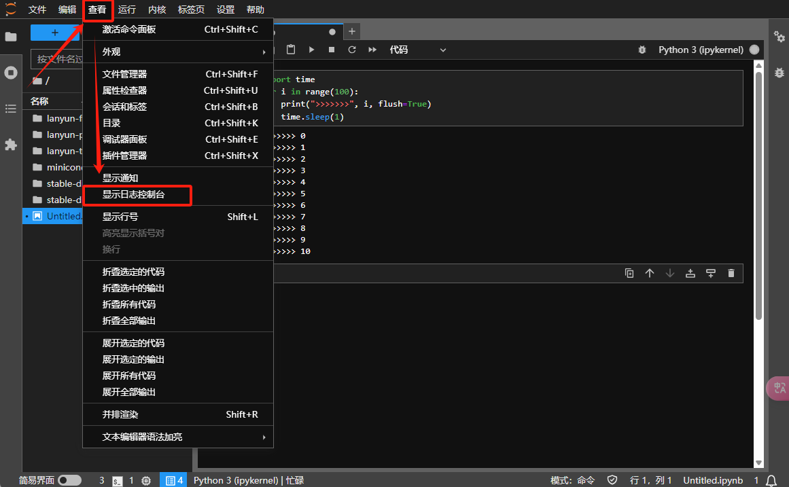

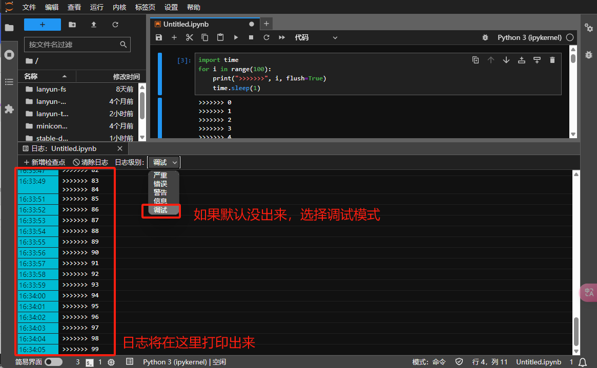

## 2.5 更换镜像

前置条件：[已关机]状态

支持更换实例的镜像。注意，更换镜像后，当前系统盘所有数据会被替换为新镜像数据。

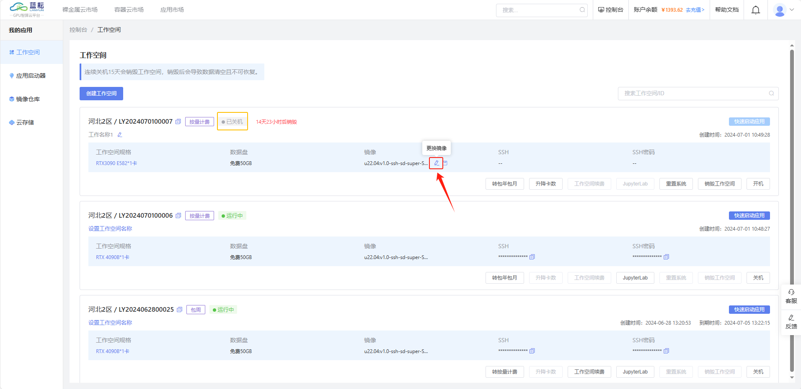

## 2.6 保存镜像

前置条件：[已关机]状态

支持将实例的系统盘（即系统环境）保存为镜像，供其他实例使用，避免重复配置系统环境。保存之后可以在【镜像仓库】查看

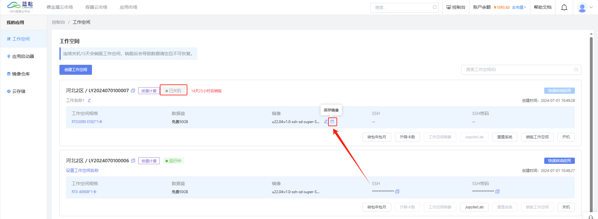

## 2.7 转换计费方式

平台提供灵活可变的计费方式，包年包月和按量计费支持互转。

 转按量计费会将原包年包月订单按照按量计费方式结算，然后形成按量计费的新订单；

 转包年包月会将原按量计费订单结算，然后形成包年包月的新订单。


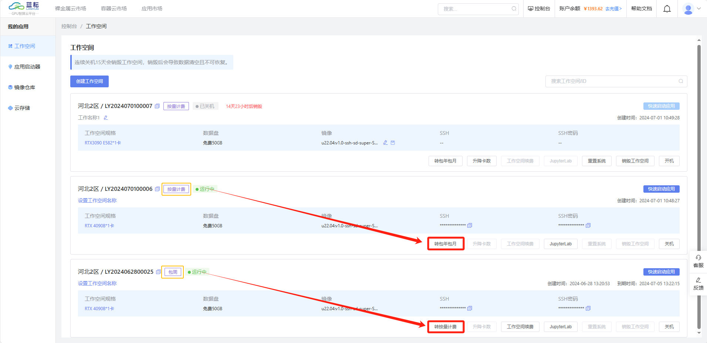


## 2.8 续费

前置条件：计费模式为包日、包周、包月、包年

平台提供包年包月计费模式下的包日、包周、包月的续费方式，续费方式是在原订单的时间基础之上进行续约。

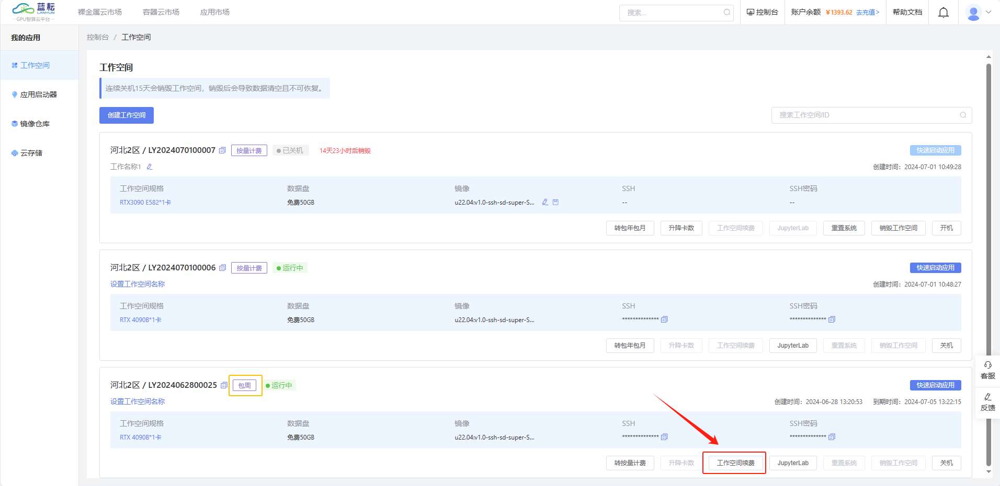


## 2.9 重置系统

前置条件：已关机状态下

重置系统将会重置系统盘，系统盘的所有数据将会被清除

## 2.10 升降卡数

前置条件：按量计费模式，已关机状态下

在原GPU卡数的基础上增加或者减少卡数，将按照更配之后的卡数重新进行计费

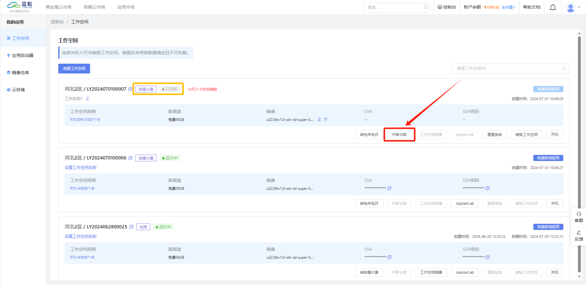


## 2.11 设置工作空间名称

设置工作工作名称有助于用户区分同一类型下的工作空间，建议设置为具有标识性的名称，名称字符数限制：1-20个字符

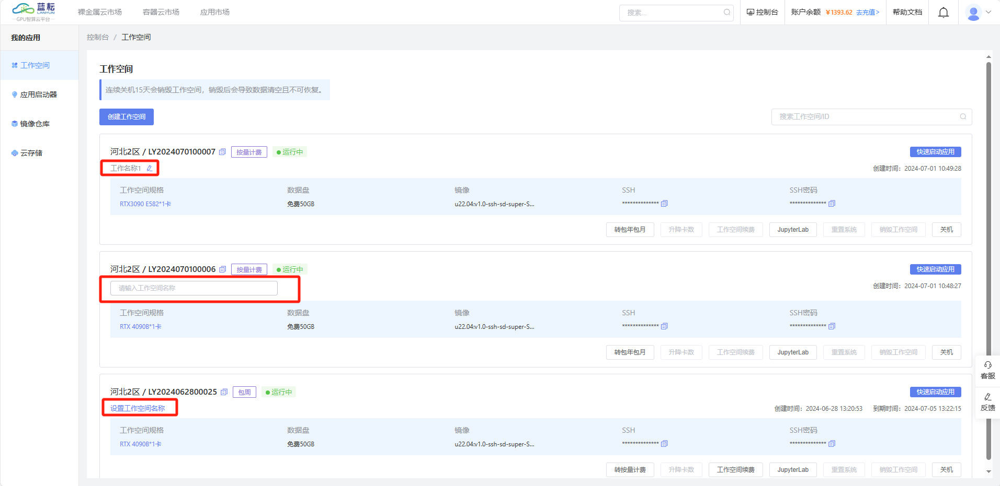

## 2.12 销毁工作空间

 销毁工作空间将会清空实例中的所有数据，请谨慎操作。

## 2.13 设置自动关机

前置条件：按量计费模式，运行中状态
设置自动关机时间将会在指定时间关机，支持修改关机时间，不影响手动关机。并且支持查看以往的设置记录

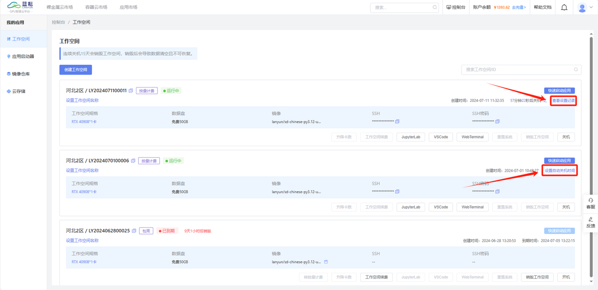

# 3.镜像仓库
## 3.1 镜像仓库

若您已在一个实例中成功配置了所需环境，并希望在切换主机或创建新实例时重用此环境。在【工作空间】点击[保存镜像]，可以将该实例下的系统盘打包成镜像，形成自建镜像，供同一区域下的其他实例使用。

当您租用新实例或更换现有实例的镜像时，可以在【镜像仓库】中、在选择您之前保存的镜像即可复原原实例系统盘内的所有数据和配置。

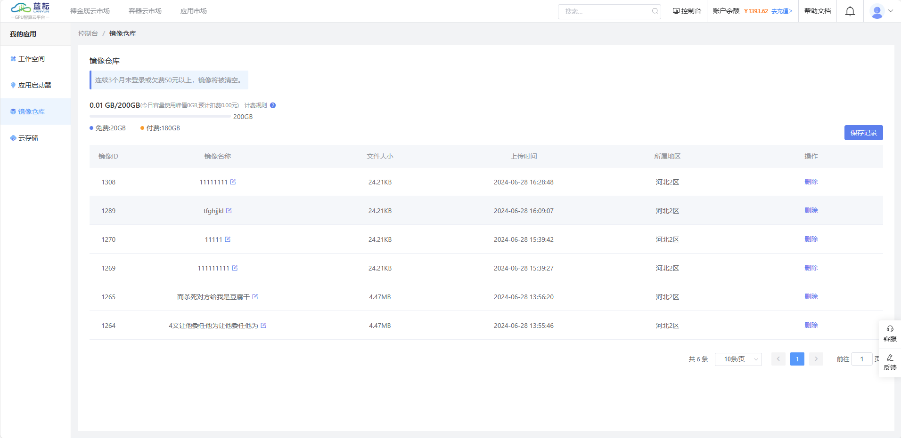

点击[保存记录]，查看以往的保存镜像的历史记录。


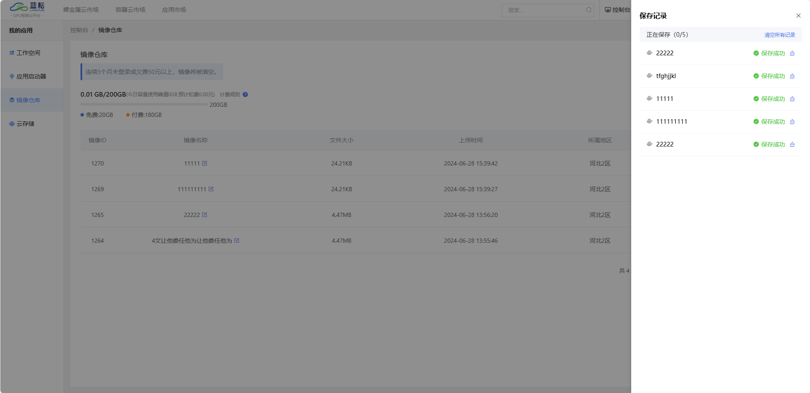

# 4、云存储

云存储采用共享存储的方式，可挂载至同一地区下不同实例下。


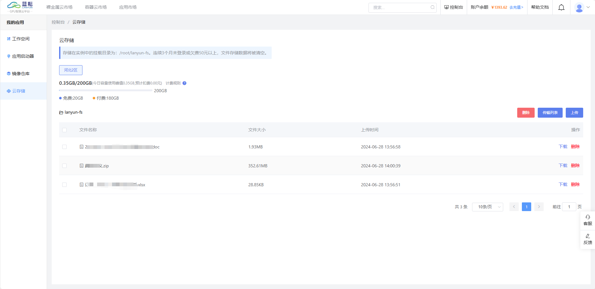

 在购买某一地区的实例之后，初始化该地区的云存储，该地区的实例重新开机后将会挂载文件存储至 /root/lanyun-fs。注意：初始化之前的实例，需要重启之后才可以挂载在该地区的云存储下。初始化之后的新购实例可以正常挂载。


## 4.1 上传

 对于小容量文件，可以直接上传；大容量文件建议通过Xftp等传输工具进行传输，用时更短，效率更高

## 4.2 下载

 支持文件下载，暂不支持文件包下载

## 4.3 传输列表

上传或下载文件的传输进度可在传输列表模块实时查看，并支持断点续传


## 5 **上传应用操作指南**

### **5.1.概述**
本文档详细介绍了如何在系统中自主上传应用镜像。上传应用镜像后，您可以根据需要对其进行配置、启动和管理。

### **5.2.系统要求**
- **镜像操作系统**：Ubuntu
- **浏览器要求**：建议使用 Chrome 浏览器
- **网络要求**：上传应用镜像需要稳定的网络连接。

### **5.3.上传步骤**

#### **5.3.1准备上传的应用镜像文件：**
确保您的应用镜像文件已经准备好，格式一般为 .tar.gz 。
#### **5.3.2确认应用镜像兼容性：**
确保您上传的应用镜像与目标平台兼容，并符合系统要求（如 x86、内存、CPU等）。

#### **5.3.3上传应用镜像**

#### **5.3.4进入上传应用界面：**
在【应用启动器】或者【我的应用】点击【我的应用】，点击进入。点击【上传应用】
#### **选择构建方式：**
根据平台要求选择适合的上传方式，例如选择[基于外部仓库]或[基于平台镜像仓库]。
#### **保存并确认上传：**
确认所有设置无误后，点击“保存”或“上传”按钮。此时应用将开始上传并初始化。
#### **镜像文件部分：**

```
FROM user/image:tag

# 安装boot.sh启动脚本，启动supervisord进程
ADD http://214.10.7.24/boot.sh /init/boot/boot.sh

ADD http://214.10.7.24/supervisord/supervisord_static /usr/local/bin/supervisord

ADD http://214.10.7.24/supervisord/supervisor.ini /init/supervisord/supervisor.ini

ENTRYPOINT ["bash","/init/boot/boot.sh"]

# 工作目录
WORKDIR /root/

# 安装openssh、webTerminal等功能软件包
ENV DEBIAN_FRONTEND=noninteractive

RUN apt-get update && \
    apt-get upgrade -y && \
    apt-get install --no-install-recommends -y \
        tar unrar rar unzip htop curl wget git \
        p7zip-full gzip zip bzip2 sysstat jq iproute2 \
        net-tools screen tmux nano vim ntpdate \
        inetutils-ping telnet traceroute tcpdump \
        iperf3 linux-kernel-headers build-essential \
        gcc g++ make lrzsz cmake bmon parallel \
        libgl1-mesa-dev pkg-config libgl1-mesa-glx \
        linux-libc-dev nmap cron zsh dash tzdata \
        openssh-server \
        shellinabox && \
    apt clean && \
    rm -rf /var/lib/apt/lists/*

# 配置ssh
RUN sed -i 's/#PermitRootLogin prohibit-password/PermitRootLogin yes/' /etc/ssh/sshd_config && \
    sed -i 's/#PasswordAuthentication yes/PasswordAuthentication yes/g' /etc/ssh/sshd_config && \
    sed -i 's/#UseDNS no/UseDNS no/g' /etc/ssh/sshd_config && \
    mkdir -p -m 700 /root/.ssh/ && \
    echo "# 此文件由系统自动创建，请勿删除或修改." > /root/.ssh/authorized_keys && \
    chmod 600 /root/.ssh/authorized_keys && \
    mkdir /var/run/sshd

# 安装code-server
ADD http://214.10.7.24/code-server/code-server-4.90.3-linux-amd64.tar.gz /usr/local/

RUN mv /usr/local/code-server-4.90.3-linux-amd64 /usr/local/code-server

# 安装文件管理
ADD http://214.10.7.24/filebrowser/filebrowser.tgz /etc/

RUN mv /etc/filebrowser/filebrowser /usr/local/bin/

# 安装miniconda
# # py37
# ADD http://214.10.7.24/miniconda/Miniconda3-py37_23.1.0-1-Linux-x86_64.sh ./miniconda.sh
# # py38
# ADD http://214.10.7.24/miniconda/Miniconda3-py38_23.11.0-2-Linux-x86_64.sh ./miniconda.sh
# py39
ADD http://214.10.7.24/miniconda/Miniconda3-py39_24.4.0-0-Linux-x86_64.sh ./miniconda.sh
## py310
#ADD http://214.10.7.24/miniconda/Miniconda3-py310_24.4.0-0-Linux-x86_64.sh ./miniconda.sh
# # py312
# ADD http://214.10.7.24/miniconda/Miniconda3-py312_24.4.0-0-Linux-x86_64.sh ./miniconda.sh

RUN bash /root/miniconda.sh -b -f -p /root/miniconda && \
    bash -c '/root/miniconda/bin/conda config --set auto_activate_base false' && \
    rm -f /root/miniconda.sh

# 配置容器内环境变量
ENV PATH="/root/miniconda/bin:/usr/local/code-server/bin/:${PATH}"

ENV LANG="en_US.UTF-8"

ENV LANGUAGE="en_US:en"

ENV PASSWORD="!G@sip02o22"

ENV TZ=Asia/Shanghai

# 生效配置文件
ADD http://214.10.7.24/tools/lanyun-motd /etc/lanyun-motd

RUN echo 'source /etc/profile' >> /root/.bashrc
RUN echo 'source /etc/lanyun-motd' >> /root/.bashrc

# 安装jupyterlab
RUN pip install -i https://pypi.tuna.tsinghua.edu.cn/simple \
    jupyterlab jupyterlab_server jupyterlab-language-pack-zh-CN && \
    rm -r /root/.cache/pip

# 暴露端口
EXPOSE 22 8888 8080 4200 8880 8866
```

平台管理人员会根据上面的yaml文件，给应用镜像安装必备的一些平台软件，安装完成后，会推送到平台中。

### **5.4 验证上传**
#### **5.4.1 检查上传状态：**
上传完成后，您可以在“我的应用”页面查看您的应用是否已成功上传。

应用状态应显示为“审核中”。
### **5.5 部署应用：**
在应用列表中找到您上传的应用，点击“部署”按钮，确保应用能够正常运行。
### **5.6日志检查：**
若应用启动失败，可以查看错误日志，确定问题所在并进行修复。
### **5.7.常见问题及解决方案**
#### **5.7.1上传过程中出现网络错误**
解决方案：请检查网络连接是否稳定，重新尝试上传。如果问题仍然存在，请联系管理员。
#### **5.7.2上传的应用无法启动**
解决方案：检查应用的配置项，确保所有必需的环境变量和依赖项已正确配置。可以查看系统日志以获得更多的错误信息。
### **5.7.3上传文件格式不支持**
解决方案：确保上传文件的格式符合系统要求，常见格式包括 .tar.gz。

