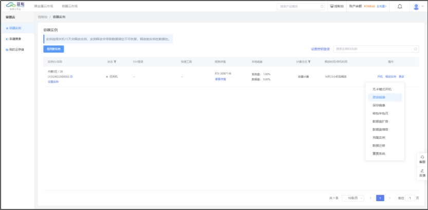

# 3 操作指南

> 注意： 系统盘空间有限，建议将大容量数据存储在数据盘或网盘中。系统重置时，数据盘和网盘中的数据不会丢失。本地存储在服务器升级维护期间可能无法访问，且本地存储的可靠性不及共享存储，为防止意外数据丢失，避免升级维护期间数据无法访问，建议将重要数据保存至 /root/lanyun-fs 目录。

## **3.1 创建实例**

​		通过容器云市场或容器实例购买所需的实例资源


​		计费方式：按量计费（后付费），包年包月（预付费）。其中包年包月相比按量计费更具性价比。

​		选择地区：选择距离您所在地较近的地区，网速性能更佳。

​		GPU型号：正在逐步更新上新，敬请关注

​		GPU数量：选择您所需的GPU数量

​		存储：我们向您提供了免费的50GB的数据盘空间，如有更高存储需求，可以进行扩容，扩容价格请前往【产品计费】查看

​		镜像：我们提供公用的镜像，包含主流模型框架、python、Cuda。也可以使用您已保存的镜像文件。自建镜像前往自建镜像查看

## **3.2 使用实例**


### **3.2.1 SSH登录**

​		SSH登录包含两种方式，口令登录和公钥登录

方式1：口令登录

​		打开Xshell或者本地的Powershell或终端。输入ssh root@服务器的公网IP


​		复制SSH密码，右击可粘贴密码，点击enter可链接服务器


方式2：公钥登录

（1）获取公钥

​		a. 打开你的 git bash 窗口

​		b. 进入 .ssh 目录：cd ~/.ssh

​		c. 找到 id/_rsa.pub 文件：ls

​		d. 查看公钥：cat id/_rsa.pub 或者 vim id/_rsa.pub


（2）打开Xshell或者本地的Powershell。输入ssh root@服务器的公网IP，可直接链接服务器。

### **3.2.2 JupyterLab**

​		整体操作界面如下，右侧为内容展示区域，左栏主要为文件管理和各类功能键

> ⚠️请注意，JupyterLab 的工作目录设置为 `/root` 目录，这与系统的根目录 `/` 不同。


当您使用Notebook运行程序后，如果过了一段时间发现日志没有新的更新，这时可以利用“日志控制台”来查看最新的日志。下面将演示如何操作：


### **3.2.3 开机/关机**

​		对于按量计费的容器实例，关机之后将停止计费，同时GPU卡会被放入容器云市场中。如果该服务器的卡数被全部抢占，您可以通过数据迁移、克隆实例将数据迁移至新实例中。

### **3.2.4** **释放实例**

​		释放实例将会清空实例中的所有数据，请谨慎操作。在实例关机后，我们将会为您保留15天的数据。

### **3.2.5** **端口映射**

​		实例无独立公网IP,不能任意开启额外的端口。但我们为每个实例都预留了一个可对外暴露的端口,可供外网访问。此功能需实名认证后使用。

点击`端口映射`入口后，系统会提供一个公网访问地址，如`cloud.lanyun.net:8866`。其中，`cloud.lanyun.net`是服务的公网地址，而`8866`是对应的端口号。


如果您启动的服务包含Web界面，那么在点击访问链接后浏览器将直接展示该界面。如果您运行的是API服务，则可以通过此地址执行API请求（注意：由于没有Web界面，所以浏览器不会显示任何页面）。
要修改不同类型的程序以监听特定端口（如 8866），您需要访问程序的配置文件或环境设置，并按照各自的配置方法来更新端口号。下面是针对 Python、Java 和 Nginx 修改监听端口至 8866 的一般步骤：

#### Python

如果是一个使用 Flask 或 Django 等框架的 Python web 应用，通常在应用启动脚本中指定端口号。例如，在 Flask 中，你可能会找到以下代码：

```
if __name__ == '__main__':
    app.run(host='0.0.0.0', port=5000)
```

你需要将 `port` 参数改为 `8866`：

```
if __name__ == '__main__':
    app.run(host='0.0.0.0', port=8866)
```

然后重启你的 Python 应用程序。

#### Java

对于 Java 应用程序，如果是使用 Spring Boot 框架，可以在 `application.properties` 或 `application.yml` 配置文件中设置服务器端口：

##### application.properties

```
server.port=8866
```

##### application.yml

```
server:
  port: 8866
```

保存更改后，重新启动 Java 应用程序以使配置生效。

#### Nginx

Nginx 的监听端口配置位于其配置文件中，通常这些配置文件位于 `/etc/nginx/nginx.conf` 或者 `/etc/nginx/sites-available/` 目录下的某个文件中。要更改监听端口，请找到类似于下面的条目：

```
server {
    listen       80;
    server_name  localhost;

    # ...
}
```

将 `listen` 指令中的端口号从 `80` 更改为 `8866`：

```
server {
    listen       8866;
    server_name  localhost;

    # ...
}
```

完成编辑后，需要重载或重启 Nginx 服务：

```
sudo nginx -s reload
# 或者
sudo systemctl restart nginx
```

请注意，实际配置过程可能因具体应用和部署细节而异。务必确认您了解每个应用程序的配置要求，并在进行任何更改之前创建备份。

如果您启动的服务包含Web界面，那么在点击`端口映射`按钮后，浏览器将直接展示该界面。如果您运行的是API服务，则可以通过此地址执行API请求（注意：由于没有Web界面，所以浏览器不会显示任何页面）。

### **3.2.6** **镜像的保存与更换**

​		在关机状态下，支持将容器实例的系统盘（即系统环境）保存为镜像，供其他实例使用，避免重复配置系统环境。保存之后的实例可以在[【自建镜像】]()查看。

​		在关机状态下，支持更换容器实例的镜像。注意，更换镜像后，当前系统盘所有数据会被替换为新镜像数据。




### **3.2.7** **数据盘的扩容与缩容**

​		平台为用户提供了免费的50GB的SSD数据盘容量，超过此范围，为用户提供了扩容范围空间。数据盘价格详情见 [1.2磁盘计费](file:///C:/Users/EDY/Desktop/C%E7%AB%AF%E5%AE%B9%E5%99%A8%E5%B9%B3%E5%8F%B0/%E6%93%8D%E4%BD%9C%E6%89%8B%E5%86%8C/%E8%93%9D%E8%80%98GPU%E6%99%BA%E7%AE%97%E4%BA%91%E5%B9%B3%E5%8F%B0%E7%94%A8%E6%88%B7%E4%BD%BF%E7%94%A8%E6%89%8B%E5%86%8C.docx#_1.2%20%E4%BA%A7%E5%93%81%E8%AE%A1%E8%B4%B9)


### **3.2.8** 克隆实例

​		在关机状态下，将以当前实例的系统盘为模板创建新实例，并将系统盘数据拷贝至新实例系统盘中。（如果需要将数据盘中的数据进行迁移，请使用数据迁移功能）

​		每日克隆次数上限为3次


### **3.2.9** **数据迁移**

​		在关机状态下，可使用数据迁移功能将数据盘中的数据迁移至目标实例下（必须是同一实例区域）。功能提供了大约每秒100MB以上的数据拷贝速度，针对小文件也进行了优化以确保高速传输。若需拷贝整个数据盘的内容，只需在`源实例数据路径`输入星号(*)作为通配符即可。


### **3.2.10** **转换计费方式**

​		平台提供灵活可变的计费方式，包年包月和按量计费支持互转。

​		转按量计费会将原包年包月订单按照按量计费方式结算，然后形成按量计费的新订单；

​		转包年包月会将原按量计费订单结算，然后形成包年包月的新订单。

### **3.2.11** **实例续费**

​		平台提供包年包月计费模式下的包日、包周、包月的续费方式，续费方式是在原订单的时间基础之上进行续约。

### **3.2.12** **无卡模式开机**

​		无卡模式配置为：0.5核心CPU, 2GB内存，无GPU卡

​		配置费用：￥0.10/时，最低消费：￥0.01

​		用户可以在无卡模式下启动设备，将需要迁移的数据从其他设备或存储介质中复制到云平台中。由于无卡模式提供了一定的CPU和内存资源，用户可以在此环境中进行数据的处理、整理和备份工作，确保数据的安全和完整性。

### **3.2.13** **资源监控**

​		在资源监控模块，用户可以实时查看GPU卡的性能，包括GPU利用率、CPU利用率、GPU显存使用量等性能指标


### **3.2.14** **实用工具**

​		平台为用户提供了镜像源的切换，系统盘的清理以及重装jupyterLab


### 3.2.15 共享网盘
共享网盘是为实现主机实例与百度网盘、阿里云盘的数据传输，包含数据上传和下载两种。
- 实例数据上传至网盘
- 网盘数据下载至实例

操作流程如下:

第一步：设置访问密码
访问密码用于直接访问共享网盘页面，相当于进入共享网盘的钥匙。您的授权信息将通过该访问密码进行加密。如忘记密码，请重新授权
操作流程如下：


第二步：授权
（1）阿里云盘
直接使用阿里云APP扫码授权
（2）百度网盘
绑定百度网盘需要前往百度网盘.开放平台（https://pan.baidu.com/union）获取AppKey、SecretKey，然后点击获取Access Token按钮获取相关值。
如何在百度网盘.开放平台获取AppKey、SecretKey,操作步骤如下：
登录百度网盘.开放平台，完成企业实名认证之后，点击右上角控制台，在我的应用点击创建按钮输入以下信息，点击立即创建


获取到AppKey、SecretKey


第三步：上传至网盘
将实例数据上传至网盘空间中，点击上传至网盘，弹出抽屉，选择需要的数据进行上传。


第四步：下载
将网盘数据下载至实例存储中，选择所需的数据，进行下载。


第五步：导出授权信息
上述授权过程需要在每个新创建的实例中重复添加，方便起见，您可以导出一份授权码，直接在别的实例下的共享网盘粘贴该授权信息，即可快速复制该实例绑定的共享网盘


### 3.2.16 其他说明

**Miniconda**

平台预装的所有镜像均包含Miniconda，其安装路径位于`/root/miniconda3/`。

若您需使用不同版本的CUDA或cuDNN，Miniconda能够让环境搭建变得简易。建议在租用实例时选择miniconda基础镜像，它不包含任何预安装的深度学习框架，从而维持一个清洁的运行环境，减少潜在问题。

以搭建TensorFlow 1.15.0版本的环境为例，本指南将演示如何利用Conda创建所需的环境。

> 若希望在数据盘中安装虚拟环境，请参照文档末尾提供的方法操作。


**创建虚拟环境**

```elm
# 创建名为tf的Conda虚拟环境，并指定Python版本为3.7：
conda create -n tf python=3.7

# 初始化bash shell以支持conda命令，并更新环境变量：
conda init bash && source /root/.bashrc

# 激活新建的虚拟环境tf：
conda activate tf
```

**安装软件依赖**

以下示例展示了如何安装 TensorFlow 版本 1.15.0：

```elm
# 在激活的Conda虚拟环境中，执行以下命令以安装 TensorFlow GPU版本 1.15.0。Conda会自动处理所需的CUDA和cuDNN依赖关系，无需进行单独安装：
conda install tensorflow-gpu==1.15.0

# 安装完成后，您可以通过以下Python代码测试TensorFlow是否正常工作：
import tensorflow as tf
hello = tf.constant('Hello, TensorFlow!')
sess = tf.Session(config=tf.ConfigProto(log_device_placement=True))
print(sess.run(hello))
```

这段Python脚本创建了一个TensorFlow会话，并在您的GPU上运行一个简单的操作，打印出“Hello, TensorFlow!”。如果能够看到输出，则表明TensorFlow已正确安装并能够访问GPU。

**Notebook环境切换**

若要在JupyterLab中使用新建的Conda环境，请按以下步骤操作：

```elm
# 创建一个新的Conda虚拟环境（如果已存在，则跳过此步骤）：
conda create -n tf python=3.7  # 创建名为“tf”的虚拟环境，并指定Python版本为3.7
# 更新环境变量以支持Conda命令：
conda init bash && source /root/.bashrc  # 初始化bash shell并更新.bashrc中的环境变量

# 接着，在JupyterLab中添加并使用新的Conda虚拟环境：
conda activate tf  # 激活名为“tf”的虚拟环境
conda install ipykernel  # 安装ipykernel以在Jupyter中使用虚拟环境
ipython kernel install --user --name=tf  # 在Jupyter中注册虚拟环境内核，其中“tf”为虚拟环境名称
```

完成这些操作后，您可以在JupyterLab启动时选择名为“tf”的虚拟环境作为内核。


若要在现有的Jupyter Notebook中使用新的Conda虚拟环境：


**清除Conda虚拟环境**

要移除已安装的Conda环境，首先退出当前激活的环境并返回至基础环境，然后使用相应的命令删除指定的环境及其所有包：

```
# 退出当前（tf）环境并返回到base环境
conda deactivate        

# 删除名为tf的环境及其包含的所有内容
conda remove -n tf --all  
```


**删除安装包和缓存**

```elm
conda clean -y --all
```


**安装虚拟环境到数据盘**

运行以下命令来配置虚拟环境和包缓存的安装路径，将虚拟环境设置为安装在 `/root/lanyun-tmp/conda/envs` 目录下，同时将包缓存定位到 `/root/lanyun-tmp/conda/pkgs`：

```elm
conda config --add envs_dirs /root/lanyun-tmp/conda/envs
conda config --add pkgs_dirs /root/lanyun-tmp/conda/pkgs
```

这些设置会将新建的虚拟环境以及下载的Conda包文件存储在自定义的目录中。

要验证新的配置路径是否已生效，您可以查看 `.condarc` 配置文件：

```
# 查看配置文件，确认路径设置是否正确
cat /root/.condarc  
```

**取消设置安装虚拟环境到数据盘**

若需要取消将虚拟环境安装到自定义位置的设置，只需编辑 `/root/.condarc` 文件，移除之前添加的相关路径行即可：

```
# 使用文本编辑器打开.condarc文件进行编辑，例如使用nano或vi
nano /root/.condarc
# 或者
vi /root/.condarc

# 然后删除对应的envs_dirs和pkgs_dirs行，保存并退出编辑器
```

确保在编辑时谨慎操作，避免不必要的配置错误。


## **3.3 自建镜像**

> 目前平台尚未提供导入自定义镜像的功能		

​		若您已在一个实例中成功配置了所需环境，并希望在切换主机或创建新实例时重用此环境。在【容器实例】点击保存实例，可以将该实例下的系统盘打包成镜像，形成自建镜像，供同一区域下的其他实例使用。


​		当您租用新实例或更换现有实例的镜像时，选择您之前保存的镜像即可复原原实例系统盘内的所有数据和配置。


## **3.4** 我的云存储

​		我的云存储采用共享存储的方式，可挂载至同一地区下不同实例。


​		在购买某一地区的实例之后，初始化该地区的云存储，该地区的实例重新开机后将会挂载文件存储至 /root/lanyun-fs。

​		注意：初始化之前的实例，需要重启之后才可以挂载在该地区的云存储下。初始化之后的新购实例可以正常挂载。


1、上传

​		对于小容量文件，可以直接上传；大容量文件建议通过Xftp等传输工具进行传输，用时更短，效率更高

2、下载

​		支持文件下载，暂不支持文件包下载。

## **3.5 发票管理**

​		本司只提供纸质版发票，暂不支持电子发票

1、发票申请

第一步：进入开具发票页面

​		登录智算云平台，进入发票管理页面


第二步：填写发票抬头信息

​		依次填写发票信息


第三步：填写寄送地址信息

​		依次填写邮寄信息（邮费到付），务必保证信息正确，避免您收不到发票。发票信息个数上限为8个。


第四步：申请开票

​		填写申请开票金额，选择收获地址，确认开票


第五步：收取发票

​		您的纸质发票申请将于15个工作日内完成审批及开具，开具之后将会向您填写的邮寄电话发送短信提醒，请注意查收。

2、发票冲红

​		如您需求进行发票冲红，请联系客服，将原发票返回至本司进行冲红，冲红后原发票金额将自动退回可开票金额中。

3、作废发票、申请退票

​		您已申请发票但因发票信息错误等原因需要作废申请、申请退票，请及时联系客服重开发票。如发票已寄出，请耐心等待发票冲红后再进行重开。

## **3.6 实名认证**

### **3.6.1 实名认证入口**

实名认证可以通过三种途径进入 **实名认证** 页面

方式1：【控制台】页面 **账号信息**，点击“未实名”进入  **实名认证** 页面


方式2：【容器实例】页面中，已购实例/--端口映射，出现提示弹框，点击“去认证”进入 **实名认证** 页面


方式3：【账号信息】页面中，实名认证信息，点击“去认证”进入 **实名认证** 页面


### **3.6.2 实名认证类型**

​	实名认证的类型有：个人实名认证和企业实名认证。两种实名认证类型适用的场景不同，支持的云上操作也不同。

1、个人认证

​	如果您是个体用户，请选择个人认证。

​	需要提供以下资料：身份证件正反面照片、注册平台手机号码。注意手机号码拥有者必须和身份证用户为同一人。


2、企业认证/-法人认证

​	如果您是企业法人，请选择企业认证中的法人认证。

​	需要提供以下资料：身份证件正反面照片、营业执照照片、注册平台手机号码。注意手机号码拥有者必须和身份证用户为同一人。


3、企业认证/-被授权人认证

​	如果您是企业被授权人，请选择企业认证中的被授权人认证。

​	需要提供以下资料：身份证件正反面照片、营业执照照片、授权书声明（平台提供模板）、注册平台手机号码。注意手机号码拥有者必须和身份证用户为同一人。


**注意事项：**

​	1、实名认证提交后需人工审核，时效1-3个工作日。

​	2、身份证持有者和平台手机号码注册者必须为同一人。

​	3、实名认证每日提交次数上限为5，请注意次数上限。

​	4、上传图片格式要求：支持jpg、jpeg、png格式，大小不超过5M。

​	5、请详细阅读《服务条款协议》并同意，方可提交认证。

### **3.6.3  认证主体变更**

​	当您的账号认证主体由于认证错误、公司业务变更等原因，需要从个人认证主体变更为企业认证主体时，可以进行实名主体变更操作。

​	目前蓝耘智算云频台支持账号属性从个人变更为企业。

​	在 **实名认证** 页面，点击“转为企业认证”，提交相应的信息即可。

## 3.7 代金券

> 存在余额和代金券的情况下，下单时优先扣除代金券

### 3.7.1 兑换代金券

​		在兑换之前，您需要准备好由客服人员向您发送的信息包含：1、企业名称；2、兑换码；3、密钥

第一步：在【控制台】页面，点击兑换按钮


第二步：输入准备好的信息

> 平台代金券指定账号，其他账号后无法兑换


### 3.7.2 查看兑换记录

在【控制台】页面，点击 ”代金券 1 张“区域，进入 **代金券** 页面


