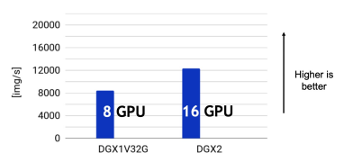
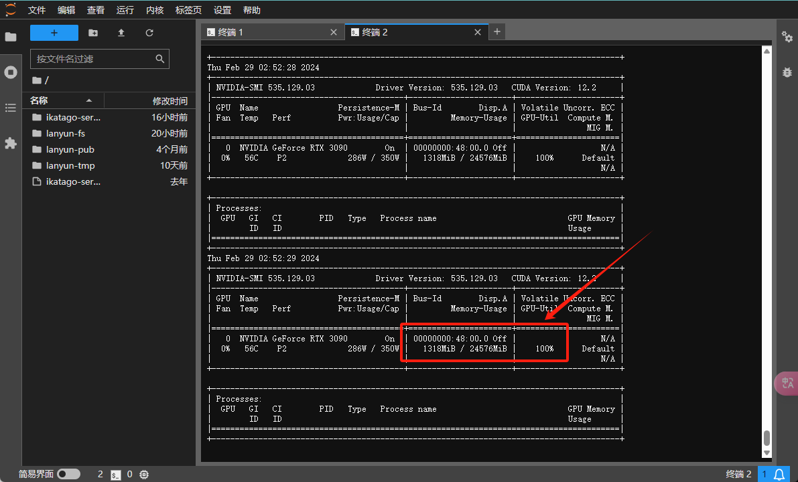
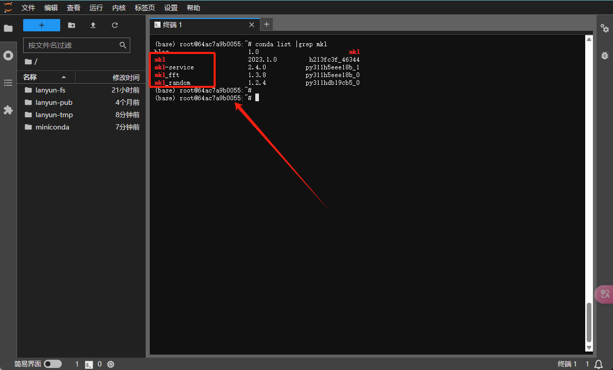
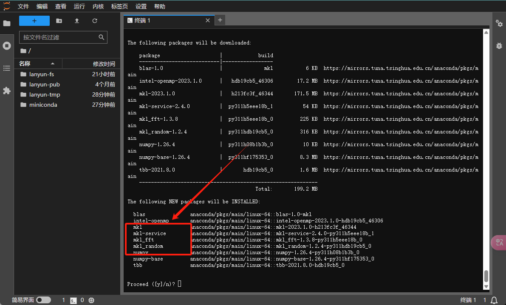
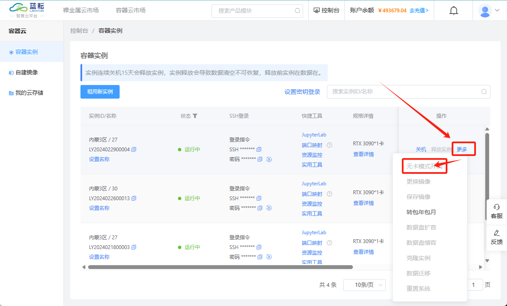

# 5 其他

## 5.1 如何访问国外站点？如GitHub等网站

```
访问国外站点，可以配置学术加速

在终端中使用：
source /etc/network_turbo 

取消学术加速，如果不再需要建议关闭学术加速，因为该加速可能对正常网络造成一定影响
unset http_proxy && unset https_proxy

```

## 5.2 如何选择GPU

​	在蓝耘平台上，GPU、CPU和内存的分配机制遵循如下规则：根据租用的GPU数量成比例地分配CPU和内存资源。算力市场展示的CPU和内存数据是基于每块GPU的分配情况。例如，如果租用两块GPU，那么实际可用的CPU和内存将是显示数值的两倍。另外，请注意，GPU资源不会被共享，每个实例都拥有对所租用GPU的独占使用权。

**. 选择CPU**

​	CPU的作用不容忽视！虽然它不直接执行深度学习模型的计算，但CPU必须提供足够的数据处理能力，以支持模型训练的数据吞吐需求。例如，在一台配备8块NVIDIA V100显卡的DGX服务器上，ResNet-50 ImageNet图像分类的训练吞吐量可达到每秒8000张图片。而当配置扩展至16块V100显卡的DGX-2服务器时，并未看到吞吐量翻倍，这表明CPU可能已经成为限制性能的瓶颈。



​	通常，我们为每块GPU分配一定数量的CPU逻辑核心。在理想状况下，希望看到模型的计算吞吐量随着GPU数量线性增加，这意味着针对单个GPU分配的合理CPU逻辑核心数量可以按比例扩展至多GPU配置。Lanyun平台提供了不同规格的CPU配额以满足这一需求；建议每个GPU至少配置4至8个CPU核心，以确保多线程异步数据加载的效率。

​	超过这一配额后，增加更多CPU核心可能不会显著提升性能，因为此时的瓶颈往往是由Python多进程切换和数据传输造成的开销（例如使用PyTorch的DataLoader）。若要节约成本并克服数据加载瓶颈，您可以尝试Lanyun平台上基于C++和CUDA开发的NVIDIA DALI数据加载加速库。在我们的测试中，使用NVIDIA DALI的单核CPU实例在数据读取能力上已经超越基于Python的八核心实例，确保了模型训练的高效率。

​	在Lanyun平台中，可供选择的高性能CPU配置如下：

- 内蒙古A区配备的A5000、3090和A40 GPU实例使用AMD EPYC 7543 CPU。
- 内蒙古A区搭载A100 GPU的实例则配置了AMD EPYC 7763 CPU。
- 北京A区的3090 GPU实例可选Intel(R) Xeon(R) Gold 6330或AMD EPYC 7642 CPU。
- 深圳A区的3090 GPU实例采用Intel(R) Xeon(R) Gold 6330 CPU。

> 服务器CPU通常拥有比桌面CPU更多的核心，尽管其主频可能不那么高。因此，从桌面CPU过渡到服务器CPU时，您需要充分发挥其多核心优势以确保最佳性能表现。要了解如何有效利用多核性能，请点击此处。

**. 选择GPU**

Lanyun平台提供了多种GPU型号，它们大致可分为以下五个类别：

- NVIDIA Pascal架构GPU：例如TitanXp和GTX 10系列。这些GPU不支持低精度计算的硬件加速，但提供适中的单精度性能。由于成本相对较低，它们适合用于小规模模型的训练（比如Cifar10）或模型代码的调试。
- NVIDIA Volta/Turing架构GPU：包括GTX 20系列和Tesla V100等。这类GPU配备了TensorCore，以加速int8/float16的低精度计算，虽然其单精度性能提升有限。建议在这些实例上开启深度学习框架的混合精度训练功能，通常可以达到单精度训练速度的两倍以上的加速效果。
- NVIDIA Ampere架构GPU：如GTX 30系列以及Tesla A40/A100等。这些GPU搭载了第三代TensorCore，并支持TensorFloat32格式，允许直接加速单精度训练(PyTorch默认启用)。尽管如此，我们还是推荐使用高性能的float16半精度训练，以获得更显著的性能提升。
- 寒武纪 MLU 200系列加速卡：目前不支持模型训练。当使用这些加速卡进行模型推理时，需要将模型量化为int8格式，并安装兼容寒武纪MLU的深度学习框架。
- 华为 Ascend系列加速卡：支持模型的训练与推理。但使用这些加速卡需要安装MindSpore框架来执行计算任务。

选择GPU型号其实并不复杂。针对常见的深度学习模型，可以根据各型号GPU在特定精度下的算力来大致判断其训练性能。为了便于用户选择合适的GPU，Lanyun平台已经对每款GPU的算力进行了标注和排名。

选择GPU的数量取决于您的训练需求。通常认为，一个有效的训练周期应该在24小时内完成，以便您可以在次日对模型进行迭代和改进。以下是几条关于多GPU选择的建议：

- **单块GPU**：适合数据集较小的训练任务，例如Pascal VOC等。
- **双块GPU**：可用于同单块GPU相似的任务，但您可以同时运行两组不同参数的实验，或者加大批量大小（Batch size）。
- **四块GPU**：适合中等规模数据集的训练任务，如MS COCO等。
- **八块GPU**：这是一个经典配置，适用于多种训练任务，并且能够方便地复现研究论文中的结果。
- **我需要更多！**：当您需要训练大型模型、进行大规模的参数调优，或者希望极速完成训练时，可以考虑使用更多的GPU。

## 5.3 如何选择内存

在Lanyun平台的实例中，内存使用受到严格的限制。与本地电脑不同，当内存用尽时，本地电脑可能会使用硬盘虚拟内存，从而只是导致速度下降，而在Lanyun实例中，一旦超出分配的内存限额（例如64GB），即便只多用了0.1GB，系统也会立即终止超出限额的进程，导致训练中断。因此，如果您的任务对内存需求较高，请选择配置了更多内存的主机或租用多GPU实例来确保充足的内存容量。若不确定内存使用量，建议通过实例监控功能来跟踪内存的使用状况。


## 5.4 GPU型号简介

| 型号      | 显存    | 单精(FP32) | 半精(FP16) | 详细参数                                                     |                             说明                             |
| :-------- | :------ | :--------- | :--------- | :----------------------------------------------------------- | :----------------------------------------------------------: |
| Tesla P40 | 24GB    | 11.76 T    | 11.76 T    | [查看](https://www.techpowerup.com/gpu-specs/tesla-p40.c2878) | 比较老的Pascal架构GPU，对于cuda11.x之前且对大显存有需求的算法是非常不错的选择 |
| TITAN Xp  | 12GB    | 12.15 T    | 12.15 T    | [查看](https://www.techpowerup.com/gpu-specs/titan-xp.c2948) |           比较老的Pascal架构GPU，用作入门比较合适            |
| 1080 Ti   | 11GB    | 11.34 T    | 11.34 T    | [查看](https://www.techpowerup.com/gpu-specs/geforce-gtx-1080-ti.c2877) | 和TITANXp同时代的卡，同样适合入门，但是11GB的显存偶尔会比较尴尬 |
| 2080Ti    | 11GB    | 13.45 T    | 53.8 T     | [查看](https://www.techpowerup.com/gpu-specs/geforce-rtx-2080-ti.c3305) | 图灵架构GPU，性能还不错，老一代型号中比较适合做混合精度计算的GPU。性价比高 |
| V100      | 16/32GB | 15.7 T     | 125 T      | [查看](https://www.techpowerup.com/gpu-specs/tesla-v100s-pcie-32-gb.c3467) |       老一代专业计算卡皇，半精性能高适合做混合精度计算       |
| 3060      | 12GB    | 12.74 T    | 约24T      | [查看](https://www.techpowerup.com/gpu-specs/geforce-rtx-3060.c3682) | 如果1080Ti的显存正好尴尬了，3060是不错的选择，适合新手。需要使用cuda11.x |
| A4000     | 16GB    | 19.17 T    | 约76T      | [查看](https://www.techpowerup.com/gpu-specs/rtx-a4000.c3756) |   显存和算力都比较均衡，适合进阶过程使用。需要使用cuda11.x   |
| 3080Ti    | 12GB    | 34.10 T    | 约70T      | [查看](https://www.techpowerup.com/gpu-specs/geforce-rtx-3080-ti.c3735) | 性能钢炮，如果对显存要求不高则是非常合适的选择。需要使用cuda11.x |
| A5000     | 24GB    | 27.77T     | 约117T     | [查看](https://www.techpowerup.com/gpu-specs/rtx-a5000.c3748) | 性能钢炮，如果觉得3080Ti的显存不够用A5000是合适的选择，并且半精算力高适合混合精度。需要使用cuda11.x |
| 3090      | 24GB    | 35.58 T    | 约71T      | [查看](https://www.techpowerup.com/gpu-specs/geforce-rtx-3090.c3622) | 可以看做3080Ti的扩显存版。性能和显存大小都非常够用，适用性非常强，性价比首选。需要使用cuda11.x |
| A40       | 48GB    | 37.42 T    | 149.7 T    | [查看](https://www.techpowerup.com/gpu-specs/a40-pcie.c3700) | 可以看做是3090的扩显存版。算力和3090基本持平，因此根据显存大小进行选择。需要使用cuda11.x |
| A100 SXM4 | 40/80GB | 19.5 T     | 312 T      | [查看](https://www.techpowerup.com/gpu-specs/a100-sxm4-80-gb.c3746) | 新一代专业计算卡皇，除了贵没缺点。显存大，非常适合做半精计算，因为有NVLink加持，多卡并行加速比非常高。需要使用cuda11.x |
| 4090      | 24G     | 82.58 T    | 165.2 T    | [查看](https://www.techpowerup.com/gpu-specs/geforce-rtx-4090.c3889) | 新一代游戏卡皇，除显存比较小和多机多卡并行效率低的缺点外，性价比非常高 |


## 5.5 GPU性能实测

评估GPU性能时，单纯参考官方公布的算力并不能完全揭示不同GPU之间的差异和优劣。例如，显存带宽对于计算耗时也有显著影响。以下是以深度学习任务为例的一项实际测试比较。

**测试细节：**

- 在Lanyun平台上使用PyTorch 1.9.0版本，对不同GPU（均为单卡环境）进行了实测。
- 网络输入采用在内存中构造的torch.zero生成的虚拟数据，从而排除了CPU预处理和额外IO操作的影响，反映出主要由GPU性能所决定的表现。
- 对ResNet50和ViT Transformer两种网络结构进行了测试。ResNet50具有较多激活函数，因此显存带宽对其性能影响较大；而ViT Transformer则更依赖于核心计算能力。
- 提供了单精度FP32和半精度FP16（非混合精度）的测试结果，用户可根据实际需求进行选择和对比。
- GPU的显存容量同样是一个关键的选购因素。关于GPU的标准规格参数，可以参阅相关文档或访问指定网站以获取更详尽的硬件信息。

Tesla P40 

```
>>> ResNet50
Namespace(device=0, model='resnet50', precision='float16', train=False)
Iteration 0, 434.37 images/s in 4.420s.
Iteration 1, 439.35 images/s in 4.370s.
Iteration 2, 439.24 images/s in 4.371s.
Iteration 3, 439.23 images/s in 4.371s.
Iteration 4, 439.14 images/s in 4.372s.
Namespace(device=0, model='resnet50', precision='float32', train=False)
Iteration 0, 496.90 images/s in 3.864s.
Iteration 1, 502.11 images/s in 3.824s.
Iteration 2, 501.87 images/s in 3.826s.
Iteration 3, 502.22 images/s in 3.823s.
Iteration 4, 501.90 images/s in 3.825s.

>>> ViT Transformer
Namespace(device=0, model='vit_base_patch16_224', precision='float16', train=False)
Iteration 0, 142.16 images/s in 13.506s.
Iteration 1, 142.32 images/s in 13.491s.
Iteration 2, 142.16 images/s in 13.506s.
Iteration 3, 142.13 images/s in 13.509s.
Iteration 4, 142.09 images/s in 13.513s.
Namespace(device=0, model='vit_base_patch16_224', precision='float32', train=False)
Iteration 0, 176.70 images/s in 10.866s.
Iteration 1, 177.25 images/s in 10.832s.
Iteration 2, 176.86 images/s in 10.856s.
Iteration 3, 176.76 images/s in 10.862s.
Iteration 4, 176.73 images/s in 10.864s.
```

Tesla T4

```elm
>>> ResNet50
Namespace(device=0, model='resnet50', precision='float16', train=False)
Iteration 0, 971.00 images/s in 1.977s.
Iteration 1, 1021.61 images/s in 1.879s.
Iteration 2, 1016.88 images/s in 1.888s.
Iteration 3, 1015.16 images/s in 1.891s.
Iteration 4, 1015.67 images/s in 1.890s.
Namespace(device=0, model='resnet50', precision='float32', train=False)
Iteration 0, 483.40 images/s in 3.972s.
Iteration 1, 495.59 images/s in 3.874s.
Iteration 2, 494.61 images/s in 3.882s.
Iteration 3, 494.01 images/s in 3.887s.
Iteration 4, 493.37 images/s in 3.892s.

>>> ViT Transformer
Namespace(device=0, model='vit_base_patch16_224', precision='float16', train=False)
Iteration 0, 359.15 images/s in 5.346s.
Iteration 1, 364.26 images/s in 5.271s.
Iteration 2, 361.07 images/s in 5.317s.
Iteration 3, 359.90 images/s in 5.335s.
Iteration 4, 359.32 images/s in 5.343s.
Namespace(device=0, model='vit_base_patch16_224', precision='float32', train=False)
Iteration 0, 103.59 images/s in 18.535s.
Iteration 1, 102.20 images/s in 18.786s.
Iteration 2, 100.97 images/s in 19.015s.
Iteration 3, 99.97 images/s in 19.206s.
Iteration 4, 99.24 images/s in 19.347s.
```

TITAN Xp

```elm
>>> ResNet50
Namespace(device=0, model='resnet50', precision='float16', train=False)
Iteration 0, 473.80 images/s in 4.052s.
Iteration 1, 511.13 images/s in 3.756s.
Iteration 2, 511.42 images/s in 3.754s.
Iteration 3, 511.76 images/s in 3.752s.
Iteration 4, 511.76 images/s in 3.752s.
Namespace(device=0, model='resnet50', precision='float32', train=False)
Iteration 0, 664.40 images/s in 2.890s.
Iteration 1, 676.98 images/s in 2.836s.
Iteration 2, 676.98 images/s in 2.836s.
Iteration 3, 677.14 images/s in 2.835s.
Iteration 4, 676.73 images/s in 2.837s.

>>> ViT Transformer
Namespace(device=0, model='vit_base_patch16_224', precision='float16', train=False)
Iteration 0, 148.05 images/s in 12.969s.
Iteration 1, 147.34 images/s in 13.031s.
Iteration 2, 146.56 images/s in 13.100s.
Iteration 3, 146.33 images/s in 13.121s.
Iteration 4, 146.14 images/s in 13.138s.
Namespace(device=0, model='vit_base_patch16_224', precision='float32', train=False)
Iteration 0, 194.03 images/s in 9.896s.
Iteration 1, 194.02 images/s in 9.896s.
Iteration 2, 193.84 images/s in 9.905s.
Iteration 3, 193.61 images/s in 9.917s.
Iteration 4, 193.37 images/s in 9.929s.
```

1080 Ti

```elm
>>> ResNet50
Namespace(device=0, model='resnet50', precision='float16', train=False)
Iteration 0, 510.45 images/s in 3.761s.
Iteration 1, 519.67 images/s in 3.695s.
Iteration 2, 518.69 images/s in 3.702s.
Iteration 3, 518.02 images/s in 3.706s.
Iteration 4, 516.89 images/s in 3.715s.
Namespace(device=0, model='resnet50', precision='float32', train=False)
Iteration 0, 635.18 images/s in 3.023s.
Iteration 1, 639.56 images/s in 3.002s.
Iteration 2, 640.22 images/s in 2.999s.
Iteration 3, 639.92 images/s in 3.000s.
Iteration 4, 638.53 images/s in 3.007s.

>>> ViT Transformer
Namespace(device=0, model='vit_base_patch16_224', precision='float16', train=False)
Iteration 0, 165.95 images/s in 11.570s.
Iteration 1, 165.96 images/s in 11.569s.
Iteration 2, 165.46 images/s in 11.604s.
Iteration 3, 165.08 images/s in 11.631s.
Iteration 4, 164.94 images/s in 11.641s.
Namespace(device=0, model='vit_base_patch16_224', precision='float32', train=False)
Iteration 0, 194.01 images/s in 9.897s.
Iteration 1, 194.03 images/s in 9.895s.
Iteration 2, 193.38 images/s in 9.929s.
Iteration 3, 193.00 images/s in 9.948s.
Iteration 4, 192.78 images/s in 9.960s.
```

2080 Ti

```elm
>>> ResNet50
Namespace(device=0, model='resnet50', precision='float16', train=False)
Iteration 0, 1358.44 images/s in 1.413s.
Iteration 1, 1869.90 images/s in 1.027s.
Iteration 2, 1870.04 images/s in 1.027s.
Iteration 3, 1869.58 images/s in 1.027s.
Iteration 4, 1869.71 images/s in 1.027s.
Namespace(device=0, model='resnet50', precision='float32', train=False)
Iteration 0, 969.06 images/s in 1.981s.
Iteration 1, 1002.68 images/s in 1.915s.
Iteration 2, 1002.68 images/s in 1.915s.
Iteration 3, 1001.45 images/s in 1.917s.
Iteration 4, 1000.07 images/s in 1.920s

>>> ViT Transformer
Namespace(device=0, model='vit_base_patch16_224', precision='float16', train=False)
Iteration 0, 758.33 images/s in 2.532s.
Iteration 1, 809.01 images/s in 2.373s.
Iteration 2, 808.82 images/s in 2.374s.
Iteration 3, 807.08 images/s in 2.379s.
Iteration 4, 804.72 images/s in 2.386s.
Namespace(device=0, model='vit_base_patch16_224', precision='float32', train=False)
Iteration 0, 210.92 images/s in 9.103s.
Iteration 1, 210.92 images/s in 9.103s.
Iteration 2, 210.07 images/s in 9.140s.
Iteration 3, 209.11 images/s in 9.182s.
Iteration 4, 208.69 images/s in 9.200s.
```

V100

```elm
>>> ResNet50
Namespace(device=0, model='resnet50', precision='float16', train=False)
Iteration 0, 2290.81 images/s in 0.838s.
Iteration 1, 2693.08 images/s in 0.713s.
Iteration 2, 2691.44 images/s in 0.713s.
Iteration 3, 2690.35 images/s in 0.714s.
Iteration 4, 2690.84 images/s in 0.714s.
Namespace(device=0, model='resnet50', precision='float32', train=False)
Iteration 0, 1288.53 images/s in 1.490s.
Iteration 1, 1327.76 images/s in 1.446s.
Iteration 2, 1325.90 images/s in 1.448s.
Iteration 3, 1326.93 images/s in 1.447s.
Iteration 4, 1326.53 images/s in 1.447s.

>>> ViT Transformer
Namespace(device=0, model='vit_base_patch16_224', precision='float16', train=False)
Iteration 0, 914.28 images/s in 2.100s.
Iteration 1, 1080.01 images/s in 1.778s.
Iteration 2, 1079.36 images/s in 1.779s.
Iteration 3, 1077.90 images/s in 1.781s.
Iteration 4, 1077.25 images/s in 1.782s.
Namespace(device=0, model='vit_base_patch16_224', precision='float32', train=False)
Iteration 0, 310.36 images/s in 6.186s.
Iteration 1, 312.70 images/s in 6.140s.
Iteration 2, 311.67 images/s in 6.160s.
Iteration 3, 310.90 images/s in 6.176s.
Iteration 4, 310.81 images/s in 6.177s.
```

3060

```elm
>>> ResNet50
Namespace(device=0, model='resnet50', precision='float16', train=False)
Iteration 0, 835.98 images/s in 2.297s.
Iteration 1, 934.63 images/s in 2.054s.
Iteration 2, 932.55 images/s in 2.059s.
Iteration 3, 932.72 images/s in 2.058s.
Iteration 4, 932.74 images/s in 2.058s.
Namespace(device=0, model='resnet50', precision='float32', train=False)
Iteration 0, 574.23 images/s in 3.344s.
Iteration 1, 582.74 images/s in 3.295s.
Iteration 2, 582.59 images/s in 3.296s.
Iteration 3, 582.60 images/s in 3.296s.
Iteration 4, 582.20 images/s in 3.298s.

>>> ViT Transformer
Namespace(device=0, model='vit_base_patch16_224', precision='float16', train=False)
Iteration 0, 405.17 images/s in 4.739s.
Iteration 1, 406.01 images/s in 4.729s.
Iteration 2, 405.60 images/s in 4.734s.
Iteration 3, 404.27 images/s in 4.749s.
Iteration 4, 403.33 images/s in 4.760s.
Namespace(device=0, model='vit_base_patch16_224', precision='float32', train=False)
Iteration 0, 229.04 images/s in 8.383s.
Iteration 1, 229.54 images/s in 8.365s.
Iteration 2, 228.84 images/s in 8.390s.
Iteration 3, 228.83 images/s in 8.390s.
Iteration 4, 228.82 images/s in 8.391s.
```

3080

```elm
>>> ResNet50
Namespace(device=0, model='resnet50', precision='float16', train=False)
Iteration 0, 1920.60 images/s in 1.000s.
Iteration 1, 2006.67 images/s in 0.957s.
Iteration 2, 2001.53 images/s in 0.959s.
Iteration 3, 2001.84 images/s in 0.959s.
Iteration 4, 2001.73 images/s in 0.959s.
Namespace(device=0, model='resnet50', precision='float32', train=False)
Iteration 0, 1214.12 images/s in 1.581s.
Iteration 1, 1245.95 images/s in 1.541s.
Iteration 2, 1246.12 images/s in 1.541s.
Iteration 3, 1245.95 images/s in 1.541s.
Iteration 4, 1246.00 images/s in 1.541s.

>>> ViT Transformer
Namespace(device=0, model='vit_base_patch16_224', precision='float16', train=False)
Iteration 0, 914.68 images/s in 2.099s.
Iteration 1, 920.83 images/s in 2.085s.
Iteration 2, 918.87 images/s in 2.090s.
Iteration 3, 916.63 images/s in 2.095s.
Iteration 4, 915.49 images/s in 2.097s.
Namespace(device=0, model='vit_base_patch16_224', precision='float32', train=False)
Iteration 0, 519.68 images/s in 3.695s.
Iteration 1, 524.02 images/s in 3.664s.
Iteration 2, 522.04 images/s in 3.678s.
Iteration 3, 521.62 images/s in 3.681s.
Iteration 4, 521.24 images/s in 3.684s.
```

3080 Ti

```elm
>>> ResNet50
Namespace(device=0, model='resnet50', precision='float16', train=False)
Iteration 0, 2044.40 images/s in 0.939s.
Iteration 1, 2274.77 images/s in 0.844s.
Iteration 2, 2273.13 images/s in 0.845s.
Iteration 3, 2276.35 images/s in 0.843s.
Iteration 4, 2272.15 images/s in 0.845s.
Namespace(device=0, model='resnet50', precision='float32', train=False)
Iteration 0, 1351.29 images/s in 1.421s.
Iteration 1, 1410.54 images/s in 1.361s.
Iteration 2, 1407.80 images/s in 1.364s.
Iteration 3, 1405.99 images/s in 1.366s.
Iteration 4, 1407.29 images/s in 1.364s.

>>> ViT Transformer
Namespace(device=0, model='vit_base_patch16_224', precision='float16', train=False)
Iteration 0, 928.04 images/s in 2.069s.
Iteration 1, 928.41 images/s in 2.068s.
Iteration 2, 928.91 images/s in 2.067s.
Iteration 3, 929.32 images/s in 2.066s.
Iteration 4, 929.39 images/s in 2.066s.
Namespace(device=0, model='vit_base_patch16_224', precision='float32', train=False)
Iteration 0, 536.28 images/s in 3.580s.
Iteration 1, 542.15 images/s in 3.541s.
Iteration 2, 541.91 images/s in 3.543s.
Iteration 3, 540.96 images/s in 3.549s.
Iteration 4, 541.44 images/s in 3.546s.
```

3090

```elm
>>> ResNet50
Namespace(device=0, model='resnet50', precision='float16', train=False)
Iteration 0, 2294.06 images/s in 0.837s.
Iteration 1, 2391.29 images/s in 0.803s.
Iteration 2, 2396.06 images/s in 0.801s.
Iteration 3, 2394.62 images/s in 0.802s.
Iteration 4, 2402.61 images/s in 0.799s.
Namespace(device=0, model='resnet50', precision='float32', train=False)
Iteration 0, 1453.34 images/s in 1.321s.
Iteration 1, 1490.90 images/s in 1.288s.
Iteration 2, 1491.79 images/s in 1.287s.
Iteration 3, 1493.76 images/s in 1.285s.
Iteration 4, 1494.50 images/s in 1.285s.

>>> ViT Transformer
Namespace(device=0, model='vit_base_patch16_224', precision='float16', train=False)
Iteration 0, 1044.44 images/s in 1.838s.
Iteration 1, 1047.37 images/s in 1.833s.
Iteration 2, 1046.37 images/s in 1.835s.
Iteration 3, 1044.68 images/s in 1.838s.
Iteration 4, 1043.91 images/s in 1.839s.
Namespace(device=0, model='vit_base_patch16_224', precision='float32', train=False)
Iteration 0, 596.59 images/s in 3.218s.
Iteration 1, 599.41 images/s in 3.203s.
Iteration 2, 598.86 images/s in 3.206s.
Iteration 3, 597.92 images/s in 3.211s.
Iteration 4, 597.46 images/s in 3.214s.
```

3090 Ti

```elm
>>> ResNet50
Namespace(device=0, model='resnet50', precision='float16', train=False)
Iteration 0, 2307.14 images/s in 0.832s.
Iteration 1, 2569.71 images/s in 0.747s.
Iteration 2, 2570.15 images/s in 0.747s.
Iteration 3, 2570.29 images/s in 0.747s.
Iteration 4, 2569.88 images/s in 0.747s.
Namespace(device=0, model='resnet50', precision='float32', train=False)
Iteration 0, 1578.58 images/s in 1.216s.
Iteration 1, 1612.02 images/s in 1.191s.
Iteration 2, 1612.37 images/s in 1.191s.
Iteration 3, 1612.63 images/s in 1.191s.
Iteration 4, 1612.32 images/s in 1.191s.

>>> ViT Transformer
Namespace(device=0, model='vit_base_patch16_224', precision='float16', train=False)
Iteration 0, 1214.12 images/s in 1.581s.
Iteration 1, 1223.07 images/s in 1.570s.
Iteration 2, 1222.81 images/s in 1.570s.
Iteration 3, 1221.12 images/s in 1.572s.
Iteration 4, 1223.38 images/s in 1.569s.
Namespace(device=0, model='vit_base_patch16_224', precision='float32', train=False)
Iteration 0, 686.56 images/s in 2.797s.
Iteration 1, 693.84 images/s in 2.767s.
Iteration 2, 693.32 images/s in 2.769s.
Iteration 3, 691.64 images/s in 2.776s.
Iteration 4, 691.63 images/s in 2.776s.
```

4080

```elm
>>> ResNet50
Namespace(device=0, model='resnet50', precision='float16', train=False)
Iteration 0, 2820.86 images/s in 0.681s.
Iteration 1, 3011.58 images/s in 0.638s.
Iteration 2, 3011.31 images/s in 0.638s.
Iteration 3, 3008.65 images/s in 0.638s.
Iteration 4, 3008.97 images/s in 0.638s.
Namespace(device=0, model='resnet50', precision='float32', train=False)
Iteration 0, 1482.35 images/s in 1.295s.
Iteration 1, 1523.34 images/s in 1.260s.
Iteration 2, 1523.15 images/s in 1.261s.
Iteration 3, 1523.25 images/s in 1.260s.
Iteration 4, 1523.21 images/s in 1.260s.

>>> ViT Transformer
Namespace(device=0, model='vit_base_patch16_224', precision='float16', train=False)
Iteration 0, 1370.73 images/s in 1.401s.
Iteration 1, 1407.86 images/s in 1.364s.
Iteration 2, 1407.92 images/s in 1.364s.
Iteration 3, 1407.89 images/s in 1.364s.
Iteration 4, 1407.85 images/s in 1.364s.
Namespace(device=0, model='vit_base_patch16_224', precision='float32', train=False)
Iteration 0, 754.60 images/s in 2.544s.
Iteration 1, 765.20 images/s in 2.509s.
Iteration 2, 764.60 images/s in 2.511s.
Iteration 3, 763.97 images/s in 2.513s.
Iteration 4, 764.00 images/s in 2.513s.
```

4090

```elm
>>> ResNet50
Namespace(device=0, model='resnet50', precision='float16', train=False)
Iteration 0, 3832.93 images/s in 0.501s.
Iteration 1, 4286.27 images/s in 0.448s.
Iteration 2, 4285.56 images/s in 0.448s.
Iteration 3, 4286.17 images/s in 0.448s.
Iteration 4, 4285.75 images/s in 0.448s.
Namespace(device=0, model='resnet50', precision='float32', train=False)
Iteration 0, 2175.56 images/s in 0.883s.
Iteration 1, 2292.56 images/s in 0.837s.
Iteration 2, 2292.38 images/s in 0.838s.
Iteration 3, 2292.68 images/s in 0.837s.
Iteration 4, 2292.69 images/s in 0.837s.

>>> ViT Transformer
Namespace(device=0, model='vit_base_patch16_224', precision='float16', train=False)
Iteration 0, 1890.34 images/s in 1.016s.
Iteration 1, 2028.98 images/s in 0.946s.
Iteration 2, 2028.92 images/s in 0.946s.
Iteration 3, 2027.23 images/s in 0.947s.
Iteration 4, 2023.66 images/s in 0.949s.
Namespace(device=0, model='vit_base_patch16_224', precision='float32', train=False)
Iteration 0, 1099.47 images/s in 1.746s.
Iteration 1, 1135.05 images/s in 1.692s.
Iteration 2, 1132.25 images/s in 1.696s.
Iteration 3, 1131.92 images/s in 1.696s.
Iteration 4, 1132.28 images/s in 1.696s.
```

A4000

```elm
>>> ResNet50
Namespace(device=0, model='resnet50', precision='float16', train=False)
Iteration 0, 1254.25 images/s in 1.531s.
Iteration 1, 1311.96 images/s in 1.463s.
Iteration 2, 1311.90 images/s in 1.464s.
Iteration 3, 1312.18 images/s in 1.463s.
Iteration 4, 1312.14 images/s in 1.463s.
Namespace(device=0, model='resnet50', precision='float32', train=False)
Iteration 0, 771.57 images/s in 2.488s.
Iteration 1, 784.02 images/s in 2.449s.
Iteration 2, 783.86 images/s in 2.449s.
Iteration 3, 783.59 images/s in 2.450s.
Iteration 4, 783.17 images/s in 2.452s.

>>> ViT Transformer
Namespace(device=0, model='vit_base_patch16_224', precision='float16', train=False)
Iteration 0, 663.73 images/s in 2.893s.
Iteration 1, 663.15 images/s in 2.895s.
Iteration 2, 658.92 images/s in 2.914s.
Iteration 3, 657.24 images/s in 2.921s.
Iteration 4, 654.88 images/s in 2.932s
Namespace(device=0, model='vit_base_patch16_224', precision='float32', train=False)
Iteration 0, 402.74 images/s in 4.767s.
Iteration 1, 403.16 images/s in 4.762s.
Iteration 2, 401.44 images/s in 4.783s.
Iteration 3, 400.12 images/s in 4.799s.
Iteration 4, 399.10 images/s in 4.811s.
```

A10

```elm
>>> ResNet50
Namespace(device=0, model='resnet50', precision='float16', train=False)
Iteration 0, 1697.60 images/s in 1.131s.
Iteration 1, 1757.48 images/s in 1.092s.
Iteration 2, 1754.84 images/s in 1.094s.
Iteration 3, 1754.40 images/s in 1.094s.
Iteration 4, 1754.48 images/s in 1.094s.
Namespace(device=0, model='resnet50', precision='float32', train=False)
Iteration 0, 1016.25 images/s in 1.889s.
Iteration 1, 1036.64 images/s in 1.852s.
Iteration 2, 1035.70 images/s in 1.854s.
Iteration 3, 1035.60 images/s in 1.854s.
Iteration 4, 1035.16 images/s in 1.855s.

>>> ViT Transformer
Namespace(device=0, model='vit_base_patch16_224', precision='float16', train=False)
Iteration 0, 856.75 images/s in 2.241s.
Iteration 1, 871.17 images/s in 2.204s.
Iteration 2, 869.76 images/s in 2.208s.
Iteration 3, 867.95 images/s in 2.212s.
Iteration 4, 867.44 images/s in 2.213s.
Namespace(device=0, model='vit_base_patch16_224', precision='float32', train=False)
Iteration 0, 505.03 images/s in 3.802s.
Iteration 1, 508.22 images/s in 3.778s.
Iteration 2, 507.10 images/s in 3.786s.
Iteration 3, 507.09 images/s in 3.786s.
Iteration 4, 506.34 images/s in 3.792s.
```

A5000

```elm
>>> ResNet50
Namespace(device=0, model='resnet50', precision='float16', train=False)
Iteration 0, 2059.14 images/s in 0.932s.
Iteration 1, 2121.97 images/s in 0.905s.
Iteration 2, 2118.47 images/s in 0.906s.
Iteration 3, 2118.64 images/s in 0.906s.
Iteration 4, 2118.01 images/s in 0.907s.
Namespace(device=0, model='resnet50', precision='float32', train=False)
Iteration 0, 1243.93 images/s in 1.543s.
Iteration 1, 1261.84 images/s in 1.522s.
Iteration 2, 1260.91 images/s in 1.523s.
Iteration 3, 1258.10 images/s in 1.526s.
Iteration 4, 1258.15 images/s in 1.526s.

>>> ViT Transformer
Namespace(device=0, model='vit_base_patch16_224', precision='float16', train=False)
Iteration 0, 954.70 images/s in 2.011s.
Iteration 1, 953.66 images/s in 2.013s.
Iteration 2, 951.03 images/s in 2.019s.
Iteration 3, 949.82 images/s in 2.021s.
Iteration 4, 949.37 images/s in 2.022s.
Namespace(device=0, model='vit_base_patch16_224', precision='float32', train=False)
Iteration 0, 603.20 images/s in 3.183s.
Iteration 1, 605.27 images/s in 3.172s.
Iteration 2, 604.12 images/s in 3.178s.
Iteration 3, 602.88 images/s in 3.185s.
Iteration 4, 601.29 images/s in 3.193s.
```

A40

```elm
>>> ResNet50
Namespace(device=0, model='resnet50', precision='float16', train=False)
Iteration 0, 1837.41 images/s in 1.045s.
Iteration 1, 1892.04 images/s in 1.015s.
Iteration 2, 1893.29 images/s in 1.014s.
Iteration 3, 1892.99 images/s in 1.014s.
Iteration 4, 1892.73 images/s in 1.014s.
Namespace(device=0, model='resnet50', precision='float32', train=False)
Iteration 0, 1102.49 images/s in 1.742s.
Iteration 1, 1115.45 images/s in 1.721s.
Iteration 2, 1118.49 images/s in 1.717s.
Iteration 3, 1117.32 images/s in 1.718s.
Iteration 4, 1117.80 images/s in 1.718s.

>>> ViT Transformer
Namespace(device=0, model='vit_base_patch16_224', precision='float16', train=False)
Iteration 0, 1155.09 images/s in 1.662s.
Iteration 1, 1153.70 images/s in 1.664s.
Iteration 2, 1152.89 images/s in 1.665s.
Iteration 3, 1150.99 images/s in 1.668s.
Iteration 4, 1150.53 images/s in 1.669s.
Namespace(device=0, model='vit_base_patch16_224', precision='float32', train=False)
Iteration 0, 675.17 images/s in 2.844s.
Iteration 1, 680.69 images/s in 2.821s.
Iteration 2, 679.15 images/s in 2.827s.
Iteration 3, 678.90 images/s in 2.828s.
Iteration 4, 678.21 images/s in 2.831s.
```

A100

```elm
>>> ResNet50
Namespace(device=0, model='resnet50', precision='float16', train=False)
Iteration 0, 3031.31 images/s in 0.633s.
Iteration 1, 4145.68 images/s in 0.463s.
Iteration 2, 4143.08 images/s in 0.463s.
Iteration 3, 4145.51 images/s in 0.463s.
Iteration 4, 4144.79 images/s in 0.463s.
Namespace(device=0, model='resnet50', precision='float32', train=False)
Iteration 0, 2588.47 images/s in 0.742s.
Iteration 1, 2775.77 images/s in 0.692s.
Iteration 2, 2771.13 images/s in 0.693s.
Iteration 3, 2780.56 images/s in 0.691s.
Iteration 4, 2764.96 images/s in 0.694s.

>>> ViT Transformer
Namespace(device=0, model='vit_base_patch16_224', precision='float16', train=False)
Iteration 0, 1592.06 images/s in 1.206s.
Iteration 1, 1690.54 images/s in 1.136s.
Iteration 2, 1691.74 images/s in 1.135s.
Iteration 3, 1692.93 images/s in 1.134s.
Iteration 4, 1691.21 images/s in 1.135s.
Namespace(device=0, model='vit_base_patch16_224', precision='float32', train=False)
Iteration 0, 1438.29 images/s in 1.335s.
Iteration 1, 1491.85 images/s in 1.287s.
Iteration 2, 1491.50 images/s in 1.287s.
Iteration 3, 1489.87 images/s in 1.289s.
Iteration 4, 1489.75 images/s in 1.289s.
```

L40

```elm
>>> ResNet50
Namespace(device=0, model='resnet50', precision='float16', train=False)
Iteration 0, 3508.15 images/s in 0.547s.
Iteration 1, 3792.50 images/s in 0.506s.
Iteration 2, 3797.41 images/s in 0.506s.
Iteration 3, 3798.82 images/s in 0.505s.
Iteration 4, 3798.89 images/s in 0.505s.
Namespace(device=0, model='resnet50', precision='float32', train=False)
Iteration 0, 1842.46 images/s in 1.042s.
Iteration 1, 1940.97 images/s in 0.989s.
Iteration 2, 1941.14 images/s in 0.989s.
Iteration 3, 1940.94 images/s in 0.989s.
Iteration 4, 1940.85 images/s in 0.989s. 

>>> ViT Transformer
Namespace(device=0, model='vit_base_patch16_224', precision='float16', train=False)
Iteration 0, 1521.70 images/s in 1.262s.
Iteration 1, 1518.28 images/s in 1.265s.
Iteration 2, 1519.53 images/s in 1.264s.
Iteration 3, 1514.74 images/s in 1.268s.
Iteration 4, 1507.84 images/s in 1.273s.
Namespace(device=0, model='vit_base_patch16_224', precision='float32', train=False)
Iteration 0, 903.33 images/s in 2.125s.
Iteration 1, 909.27 images/s in 2.112s.
Iteration 2, 906.62 images/s in 2.118s.
Iteration 3, 901.66 images/s in 2.129s.
Iteration 4, 899.00 images/s in 2.136s.
```

## 5.6 维护与故障

由于不可控的硬件故障等原因，可能会发生异常情况。对此，我们提供以下处理措施和补偿方案：

**实例宕机**

- **确认条件**：实例意外关机，状态显示为“已关机-意外宕机”。
- **赔偿标准**：补偿时间计算从最后一次开机至宕机时刻，最多不超过24小时。补偿的代金券金额=宕机时长(小时) × 实例小时单价。对于包年包月用户，单价按照总金额除以时长计算。

**网络故障**

- **确认条件**：实例遭遇网络异常（排除用户本地网络问题，如使用VPN造成的线路异常）。
- **赔偿标准**：总异常时长(分钟) × 2，结果向上取整至小时。赔偿的代金券金额=时长(小时) × 实例小时单价。对于包年包月用户，单价同样按比例计算。

**本地磁盘故障**

- 我们提供的系统盘和数据盘均来自主机本地，虽然性能优越但没有多余副本，因此有一定的故障风险。企业级SSD在正常使用下寿命通常超过10年。由于无法保证本地存储的完全可靠性，请用户定期备份重要数据，推荐备份至个人设备或我的云存储服务中，以防数据丢失。

**不在赔偿范围内的其他情形**

- 实例状态为“运行中”，程序因未设置后台运行而意外退出。
- GPU驱动导致显存未正确释放的问题，这种情况通常不需要重启实例就可以恢复，属于正常稳定性范围内。
- 用户操作导致的系统依赖错误等，导致JupyterLab等服务无法访问。此类情况可以通过重置系统解决。
- 其他

以上概述了平台针对不同意外故障情况所提供的相应补偿措施，并指出了那些情况不会收到赔偿。

## 5.7 性能篇

首先运行`nvidia-smi -l 1`命令以监控GPU利用率。如果发现GPU使用率持续为0%，则应确认代码是否已经配置为使用GPU进行计算。若GPU使用率持续高达90%以上，可能需要考虑使用多卡并行处理或是更换为更强大的GPU来提升训练速度。

当训练速度异常缓慢时，可以执行下列基准测试代码来排查是否存在硬件问题，并同时观察GPU的利用率变化：

```elm
import torch  # 导入PyTorch库

m = k = n = 8192  # 设置矩阵的维度，这里创建了两个大小为8192x8192的矩阵

# 初始化两个浮点数(float32)类型的矩阵a和b，并将它们移动到指定的GPU设备上（在这里是'cuda:0'，即第一个GPU）
a = torch.zeros(m, k, dtype=torch.float32).cuda("cuda:0")
b = torch.zeros(k, n, dtype=torch.float32).cuda("cuda:0")

for _ in range(1000):  # 循环1000次执行矩阵乘法
    y = torch.matmul(a, b)  # 使用matmul函数进行矩阵乘法，并将结果存储在变量y中

torch.cuda.synchronize("cuda:0")  # 确保所有在'cuda:0'设备上提交的工作都已经完成
```

观察GPU的使用率。



**瓶颈分析**

首先，根据您的模型特性和性能需求，可以将训练情况分为以下几类：

1. **小型模型且数据预处理简单**：例如使用LeNet训练MNIST数据集。在这种情况下，优化空间有限，因为模型对计算能力的需求不高。通常适合使用标准GPU进行训练，更高端GPU可能无法充分利用其性能，导致使用率低。在这种场景中，GPU使用率通常较低且波动小。
2. **小型模型但数据预处理复杂**：例如使用ResNet18训练ImageNet分类任务。此时，CPU在数据预处理上的耗时较长，而GPU计算时间相对短暂，因此选择配置较好的CPU与一般水平的GPU可能更合适。此场景中，GPU使用率呈现大幅波动，峰值较高，但多数时间较低。
3. **大型模型且数据预处理简单**：通常在这种情况下，GPU利用率会持续保持在高水平且波动不大，但也对磁盘性能提出了更高要求。如果GPU利用率不高，请参考后续方法来提升性能。
4. **大型模型且数据预处理复杂**：这种情况既对CPU也对GPU提出了高要求，任何一个都可能成为性能瓶颈，包括磁盘性能也是如此，需要具体问题具体分析。

对于前两种情况，由于优化空间有限，可能更应关注如何选择合适的硬件并配合代码优化来提高成本效率。而对于后两种情况，如果发现GPU利用率偏低，建议按以下方式排查瓶颈并优化性能：

确保您使用的是支持您GPU架构的CUDA版本。对于NVIDIA Ampere架构的显卡如RTX 3060、RTX 3090、RTX 3080Ti、A4000、A40、A100、A5000等，需要使用CUDA 11.x（建议11.1或以上版本），请确保框架版本与之兼容。

**步骤1: 监控GPU利用率**

打开终端并运行以下命令来实时查看GPU的利用率：

```
nvidia-smi -l 1
```

若观察到GPU利用率为0，则有可能代码未正确配置以使用GPU。这种情况下，需要检查并修改代码确保其能够利用GPU资源。

如果GPU的利用率波动较大，并且峰值不超过50%，这通常意味着GPU在等待数据预处理完成，导致无法持续满负荷运行。接下来请参照以下步骤进行排查和优化。

**步骤2: 检查CPU利用率**

转到控制台，选择“我的实例”，然后点击“资源监控”按钮以查看CPU的使用情况。


监控CPU使用情况：

设想您有一个5核心的实例，如果观察到CPU利用率持续接近500%（即每个核心都在满负荷运行），则可能意味着CPU资源不足，导致成为性能瓶颈。此时，您可以考虑迁移到拥有更多CPU核心的主机或进行配置升级。

若CPU利用率明显低于500%，这表明您的代码未充分利用CPU的计算能力。通常，您可以通过增加PyTorch DataLoader的`num_workers`参数来提高CPU的工作负载。一个实用的经验规则是将`num_workers`设置为略低于CPU核心数的值，并测试不同的`num_workers`设置对训练性能的具体影响。

**步骤3: 代码审查与调试**

如果前两个步骤未能解决性能问题，请深入代码进行调试，识别耗时较多的部分进行详细分析。在代码层面，以下是一些可能影响性能的常见情况，同时给出了建议的解决策略：

- **迭代中非计算密集型操作**：如每次迭代后都保存测试图片等。为减少这类开销，可以考虑增加保存周期，避免每次迭代都执行时间成本高的任务。
- **频繁地保存模型状态**：如果模型状态的保存过于频繁，它可能会占用相当一部分训练时间。改进方法是适当减少保存频率或仅在关键点保存模型。

此外，您还可以参阅深度学习框架的官方性能优化指南来获取更多信息和技巧：

- 对于PyTorch用户，请参阅[PyTorch官方性能优化指南](https://pytorch.org/tutorials/recipes/recipes/tuning_guide.html)。
- 对于TensorFlow用户，请参阅[TensorFlow官方性能优化指南](https://www.tensorflow.org/guide/function)。

我们也鼓励您通过我们的网站提交反馈，分享您的经验案例，以帮助社区成员共同进步。

**NumPy版本问题**

> 进行初步诊断时，如果观察到CPU负载极高，各核心均在满负荷运行，并且即使增加了更多的核心数后CPU依然能够达到满负荷，同时GPU负载持续偏低，并且系统中使用的是Intel CPU，那么很可能是由NumPy版本不兼容或配置不当导致的性能问题。

NumPy可以利用OpenBLAS或Intel Math Kernel Library (MKL) 来进行计算加速。Intel CPU通常与MKL兼容，而AMD CPU主要支持OpenBLAS。在特定的矩阵运算任务中，使用Intel CPU配合MKL可以实现显著的性能提升。相比之下，尽管AMD CPU使用OpenBLAS时可能不如其在Intel CPU上搭配MKL那么快，但通常其表现仍然可观，因此使用AMD CPU时不必过度担心性能问题。

如果您的系统装有Intel CPU，请检查当前安装的NumPy版本是基于MKL还是OpenBLAS进行优化的。




如果NumPy的版本信息中包含了`mkl`字样，那么表明您安装的是基于MKL进行优化的版本。

当通过国内源比如清华大学提供的Conda镜像安装NumPy时，默认安装的往往是使用OpenBLAS作为加速后端的版本。如果您执行`conda install numpy`命令进行安装，会注意到有OpenBLAS相关的软件包被列出。

若要安装基于MKL优化的NumPy以提高性能，您可以按照以下步骤操作：

```elm
# 卸载当前安装的NumPy：
# 如果是使用pip安装的NumPy
pip uninstall numpy

# 如果是使用conda安装的NumPy
conda uninstall numpy

# 移除已配置的国内Conda源：
# 清空.condarc文件内容以移除国内源配置
echo "" > ~/.condarc

# 重新安装NumPy：
# 使用conda重新安装NumPy
conda install numpy
```

按照上述步骤操作后，在执行安装NumPy的过程中，应当能够看到与MKL相关的软件包被列为即将安装。




**PyTorch线程数问题**

> 识别潜在问题：若您租用了多GPU实例，并且在每块GPU上并行运行不同的实验，可能会遇到该问题。

默认情况下，PyTorch会根据CPU核心数量创建相应的线程数进行计算。在多GPU实例中，如果分别在不同的GPU上运行多个实验，每个PyTorch进程都会尝试创建与CPU核心数量相等的线程数。这样做可能导致操作系统花费大量时间进行线程调度而非进行实际计算，从而使得CPU和GPU的利用率都低下。为解决这一问题，可以在代码中使用`torch.set_num_threads(N)`来明确指定每个进程允许创建的最大线程数。

**更多经验**

1. 对于单机多卡的并行训练，如果您使用的是PyTorch框架，通常将`torch.nn.DataParallel`（DP）替换为`torch.nn.DistributedDataParallel`（DDP）可以获得更好的性能。根据官方说明，DDP提供了更高效的多GPU缩放和性能。官方原文是：`DistributedDataParallel offers much better performance and scaling to multiple-GPUs.`
2. 关于PyTorch版本的选择，特别是当使用NVIDIA Ampere架构的GPU（如RTX 3090）时，推荐使用PyTorch的最新版本，比如1.9或1.10，因为与1.7相比，这些新版本在性能上有显著提升；而1.7和1.8版本的性能较弱。如果需要，您可以在平台的`更多`中找到选项来更换至包含PyTorch 1.10版本的镜像。
3. 就平台使用策略而言，如果您的算法对资源需求很大，在同时进行多个实验调参时，建议分别在不同的主机上启动多个实例，每个实例只运行一个实验。这样做避免了在同一主机上开设多个实例或在单个实例中租用多个GPU进行不同实验，后者可能导致资源分配和管理问题，影响实验效率。


## 5.8 省钱篇

### 5.8.1 场景一

当您不需要GPU资源，例如在编写或调试代码、上传或下载数据至实例、或者进行代码演示时，可以选择以无卡模式开启实例。无卡模式意味着当前会话将使用配置较低的资源，具体包括0.5个CPU核心和2GB内存，并且不分配GPU资源。该模式的费用统一为￥0.1/小时，不影响实例上已有的数据，您可以随后再次正常开关机来恢复标准资源配置。

> 请注意，启用无卡模式将释放GPU资源，令其回到空闲状态。因此，在之后正常开机时，如果这些GPU资源已被其他用户租用，可能存在可用GPU资源不足的情况。




### 5.8.2  场景二

如果您起初只需要一块GPU进行代码调试和性能验证，然后在调试完成后为了加快训练进度需要切换到多卡并行作业，这种情况下，您可以利用实例的升降配置功能来适时调整所需GPU数量。


### 5.8.3 场景三

在不确定代码运行时间的情况下，如果您希望代码执行完毕后立即关闭实例，可以通过使用`shutdown`命令来实现自动关机。为确保命令的正确执行，最好使用命令的完整路径，例如`/usr/bin/shutdown`。

请确保提前保存程序产生的日志文件，因为一旦实例自动关机，标准输出（控制台）中的日志信息将无法再被查看。

在您希望程序运行完成后自动关机的场景中，可以将shutdown命令与程序执行命令串联起来。例如，如果您的原始执行命令是python train.py，那么您可以如下方式添加shutdown命令：

```elm
# 使用分号(;)串联指令表示无论`python test.py`执行成功与否，都将执行`/usr/bin/shutdown`
python test.py; /usr/sbin/shutdown

# 或者，
# 使用双与符号(&&)串联指令表示只有当`python test.py`成功执行后，才会执行`/usr/bin/shutdown`
python test.py && /usr/sbin/shutdown
```

请选择适合您需求的方式来组合命令。


您也可以在Python脚本执行完毕后直接嵌入`shutdown`命令。例如，您可以在Python代码中添加如下语句来实现自动关机功能：

```elm
import os

if __name__ == "__main__":
    # xxxxxx
    os.system("/usr/sbin/shutdown")
```

# 
