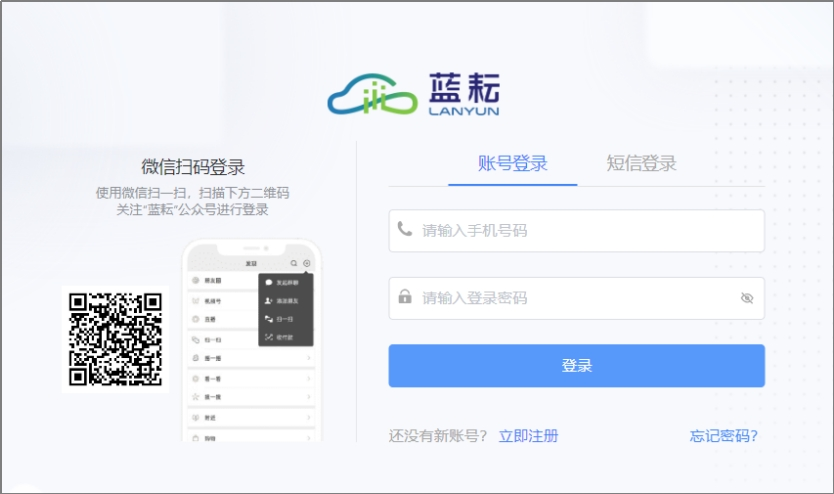
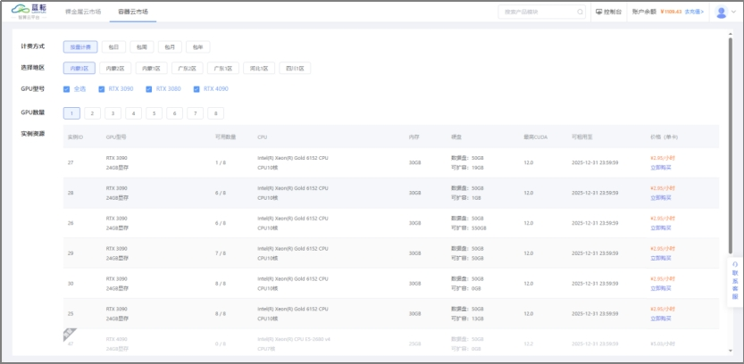
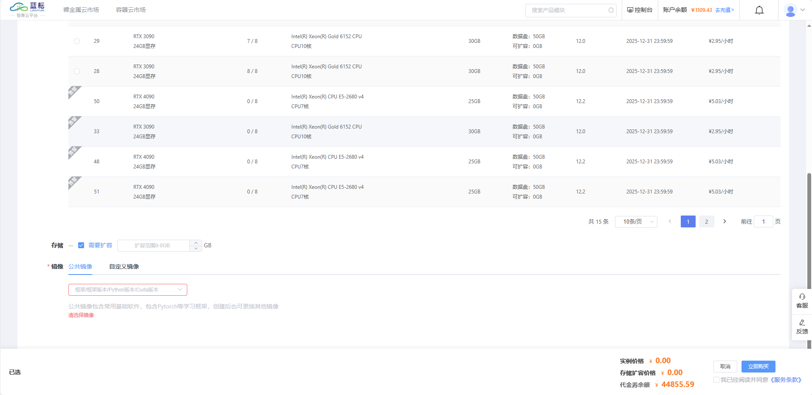
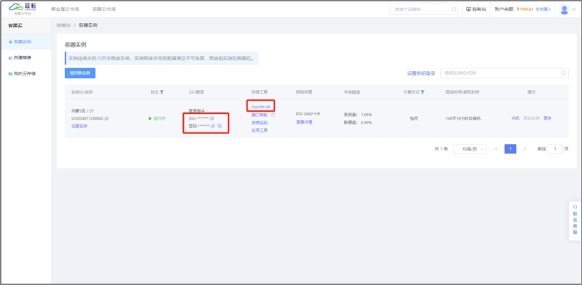
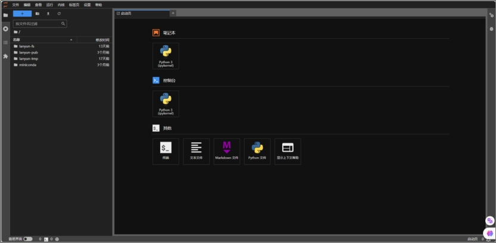
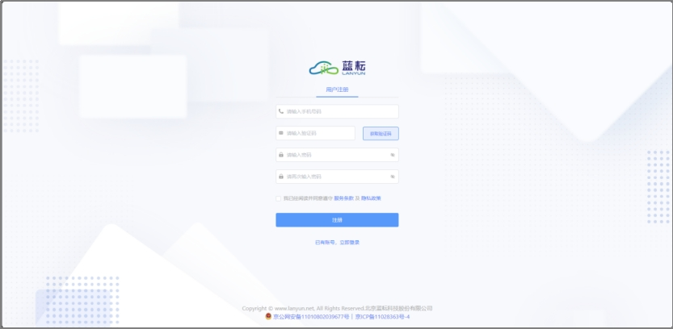
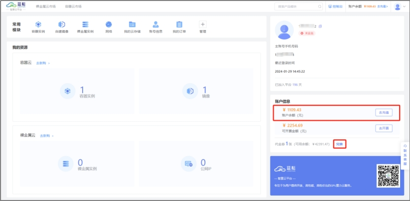
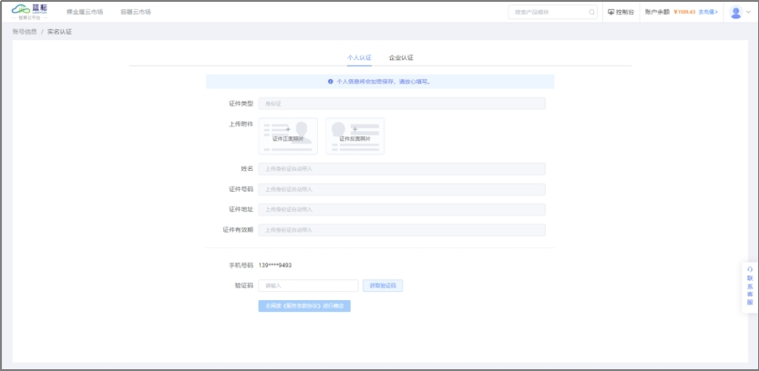
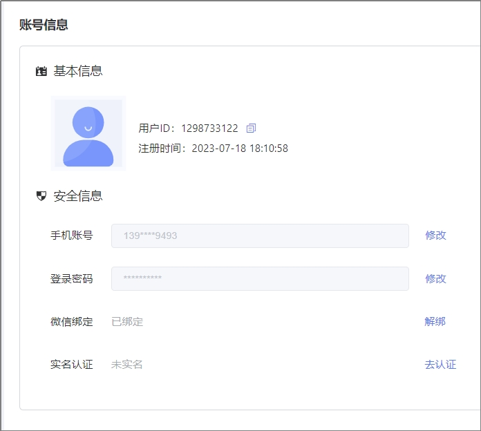

# **2 快速入门**

## **2.1 入门指引**

> 实例关机后，所有数据和环境配置都会得到保存。因此在下次开机时，无需重新进行配置或上传数据。
>
> 实例被释放，实例中的数据和配置环境也会随之被清空

使用流程

1、通过官网地址登录平台（cloud.lanyun.net）

2、进入容器云市场，创建实例。

​	第一步：选择 **计费方式** ，相比较而言，包年费用更加划算

​	第二步：选择 **地区**，选择距离您最近的地区，性能更优

​	第三步：选择 **GPU型号**，不同服务器性能不同，请参考[如何选择GPU - 挑选合适GPU资源的建议]()

​	第四步：选择 **GPU数量**

​	第五步：点击 **立即购买**。进入搭建基础环境页面，包含python、模型框架、Cuda版本

> 如果您需要更大的硬盘空间来存储数据，请关注 **硬盘** 列中 ”最大可扩容”的容量大小。

​	第六步：支付成功后，请耐心等待实例启动，便可以开始您的容器使用之旅了。

3、通过SSH或者JupyterLab等方式连接服务器

4、在此处上传数据或者在【我的云存储】上传小批量数据，训练模型。

> 如果您希望使用其他集成开发环境（IDE）进行远程开发，请查阅关于VSCode（推荐）或PyCharm的相关指导。

## **2.2 准备工作**

1、拥有一个账号，通过智算云平台登录页注册获得账号

2、充值或者代金券兑换，保证账户有充足的余额可进行下单。

3、完成实名认证，平台将会提供更多的产品功能，如端口映射，实名认证方法请参考 [实名认证]()

​		方式1：点击控制台下方的“未实名”图标，进入实名认证页面

​		方式2：点击账号信息，进入实名认证页面

4、完成微信绑定，可以扫码快速登录平台

## **2.3 产品功能**

主要功能模块包括：

​		1.注册登录

​		2.控制台

​		3.容器云市场

​		4.容器实例

​		5.自建镜像

​		6.我的云存储

​		7.我的订单

​		8.收支明细

​		9.发票管理
