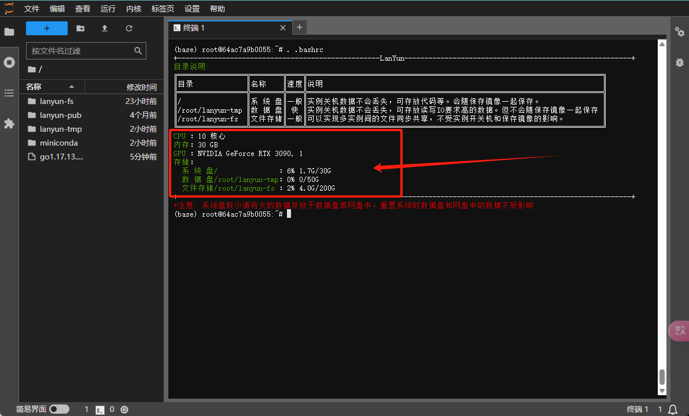
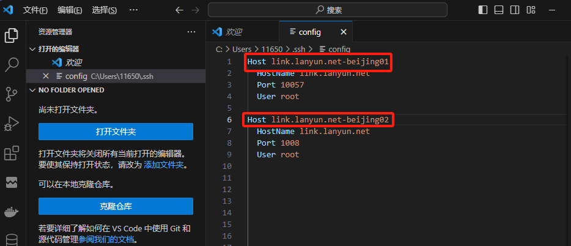
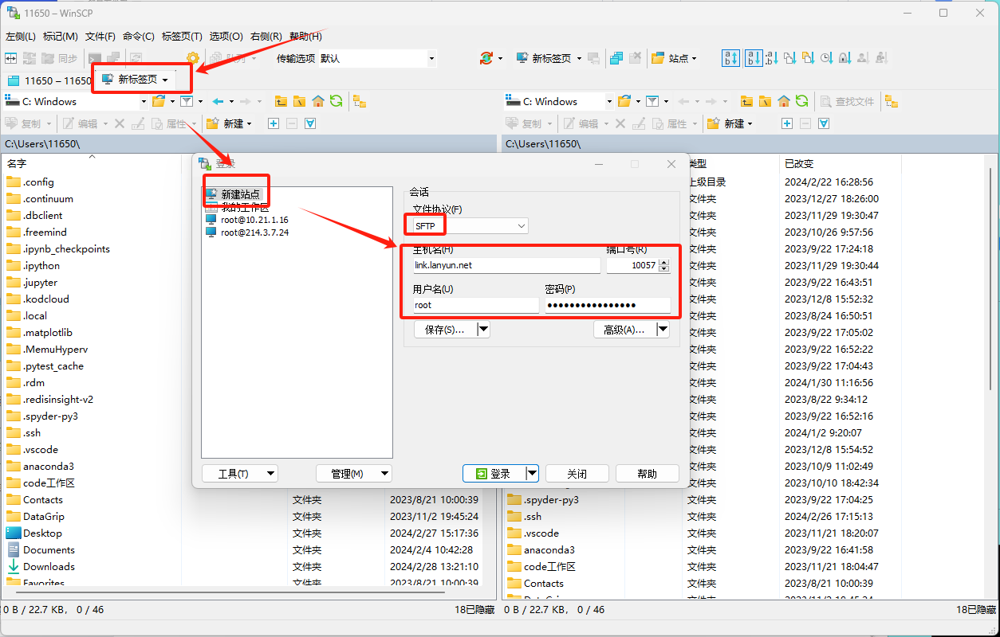

# 6 常见问题

## **6.1 系统盘空间不足**

为了确定系统盘空间的使用情况，首先需要识别哪些目录占用了大量空间。如果您不熟悉什么是系统盘，您可以查询帮助文档以获得更多信息。

要查看系统盘和数据盘的使用情况，请在终端中执行以下命令：

```elm
source ~/.bashrc
```

该命令将展示各个磁盘分区的总空间、已用空间、剩余空间以及挂载点。



以下列出的目录是您可以安全删除的，它们的移除不会影响系统的正常运行。因此，您可以首先从这些目录开始清理以释放空间。

```elm
# 查看conda历史包占用的空间并清除这些包
du -sh /root/miniconda3/pkgs/
rm -rf /root/miniconda3/pkgs/*

# 查看JupyterLab回收站占用的空间并清空回收站
du -sh /root/.local/share/Trash
rm -rf /root/.local/share/Trash/*
```


如果这样做仍未能获得足够的空间，请继续审查下面提到的可能占用较大空间的目录，并根据您的实际使用情况谨慎进行清理：

```elm
du -sh /tmp/
du -sh /root/.cache
du -sh /var/cache/apt/
```


您还可以通过平台提供的"清理系统盘"按钮来快速进行清理操作，这是一个更为便捷的选项。


**标准的空间清理流程**

开始之前，先检查文件和目录所占用的空间。通常系统根目录(`/`)下的文件夹不会消耗大量磁盘空间，所以重点关注您自己创建的目录或文件。

**文件大小**

为了查看当前目录下的文件和文件夹大小，您可以运行`ls -alh`命令，这样可以列出所有文件和文件夹以及它们的大小。例如，您可以检查`.bashrc`或`.profile`等文件占用的空间。需要注意的是，通过`ls`命令显示的文件夹大小指的是文件夹本身的大小，并不包括其中内容的总大小。


**目录大小**

要递归统计某个文件夹及其子文件夹下所有文件的总大小，您可以使用`du -sh <directory>`命令，其中`<directory>`代表您想要检查的文件夹名称。


**删除**

要删除文件或文件夹并释放空间，您可以执行`rm -rf <path>`命令，其中`<path>`是您希望删除的文件或文件夹的路径。请谨慎使用此命令，因为它会永久移除指定的内容，且无法恢复。


**特定不影响系统盘空间的文件夹**

以下目录由系统特别设定，它们不会占用系统盘的空间：

```elm
lanyun-pub
lanyun-fs
lanyun-tmp
```


## 6.2 希望彻底清理所有内容，怎么操作呢？

​		如果您确定不再需要存储的数据，并希望彻底清理所有内容，怎么办呢？可以在实例的"更多"操作菜单中选择"重置系统"功能。执行这个操作将会抹除系统盘上的所有数据。请确保您已备份任何重要数据，因为此操作不可逆转。


## 6.3 **JupyterLab无法启动**

**第1种原因**

当JupyterLab无法运行可能是因为安装其他依赖时不小心修改了JupyterLab的依赖版本。此时，您可以通过SSH连接到实例，并尝试运行`jupyter-lab`命令来检查是否有错误信息。如果命令执行失败，表明JupyterLab可能存在问题。这种情况下，您可以通过执行`pip install jupyterlab`来重新安装JupyterLab，并随后重启实例以解决问题。

对于Windows用户，可以使用命令提示符（cmd）或 PowerShell 或 Xshell 进行SSH登录。请注意，在这些工具中粘贴密码可能存在困难，您可能需要手动输入密码。


运行`jupyter-lab`命令并观察输出情况。如果显示正常运行的信息，则说明JupyterLab处于正常状态。若遇到错误提示，类似于下面列出的报错信息，则表明JupyterLab无法启动：


如果在尝试启动`jupyter-lab`时遇到错误，可尝试重新安装JupyterLab。如果系统中没有`pip`命令，请先安装它；如果连`conda`都没有，可能是由于您不小心移除了miniconda环境，在这种情况下，重置系统将是最简单的解决方法。

按照以下步骤进行操作：

1. **卸载当前的JupyterLab**：

   ```
   pip uninstall jupyterlab
   ```

2. **重新安装JupyterLab**：

   ```
   pip install jupyterlab
   ```

执行完以上步骤后，您可以尝试再次启动JupyterLab。


您还可以通过平台提供的"**重装JupyterLab**"按钮来快速进行清理操作，这是一个更为便捷的选项。


**第2种原因**

排除了其他原因之后，如果JupyterLab仍无法启动，一般情况下这可能是由于网络问题，尤其是当使用翻墙VPN时，可能会导致对带有端口号的JupyterLab地址的访问受到限制。

在这种场景下，您通常可以在浏览器中看到JupyterLab的图标，但页面本身无法加载，只显示为空白。


为了解决这一问题，您可以尝试以下步骤：

1. **关闭VPN**: 先尝试关闭VPN，然后检查是否能够正常访问JupyterLab。
2. **调整VPN设置**:
   - 如果在关闭VPN后仍无法访问，尝试重新打开VPN并切换到直连模式。
   - 如果您的VPN没有直连模式，改用PAC模式。请避免使用全局模式，因为即使在关闭VPN的情况下，某些VPN可能仍会影响系统网络。

以下是Windows操作系统上某些VPN应用的设置示例图：


如果按照以上步骤配置VPN为直连模式后，JupyterLab仍然不能打开，那么尝试以下操作：

1. 在JupyterLab网页上，按下`F12`键打开开发者工具。
2. 选择“Network”（网络）标签页。
3. 勾选“Disable cache”（禁用缓存）选项。
4. 勾选该选项后，刷新网页以再次尝试访问。


如果尝试过上述所有方法后问题仍未解决，您可以使用不同的浏览器尝试访问JupyterLab。

若问题依旧存在，请及时联系客服支持以获得进一步帮助。

## 6.4 **GPU调用失败**

首先，运行`nvidia-smi`命令来检查GPU的当前使用状况。


在上述输出中，被红色框标记的部分显示了显存占用和GPU使用率。如果在程序运行后：

- 显存没有被占用，这可能意味着您安装的框架是CPU版本而非GPU版本。验证这一点的方法如下：

如果您在PyTorch环境下工作，检查版本号是否包含`cu`字样以确定是否为CUDA版本。带有`cu`的是GPU支持的CUDA版本；没有则表示CPU版本。国内用户使用Torch官方的conda安装命令时可能会遇到bug，默认安装的是CPU版本。因此，建议使用pip进行安装，而且在执行官方的pip安装命令时，删除`-f`参数可以连接到国内的pip源，从而加快下载速度。以下是如何检查PyTorch版本的示例代码：

```
import torch
print(torch.__version__)
```

对于TensorFlow用户，可以通过以下方式获取构建信息中的CUDA版本：

```
import tensorflow as tf
sys_details = tf.sysconfig.get_build_info()
print(sys_details["cuda_version"])
```

如果观察到显存被占用且GPU使用率不为零，但波动较大，说明GPU正在使用中。在这种情况下，您可能需要对程序进行优化以提高GPU利用率。详细的优化指导可以参考相关帮助文档。

当显存有所占用，但GPU使用率持续为零时，有两种可能性：

1. 对于采用安培架构的GPU（如30系列、A40、A100、A5000等），可能需要使用CUDA 11.X版本。
2. 另一种情况是代码本身并没有利用GPU进行计算。尽管导入了相关框架和构建了网络，这些操作会分配显存，但实际上没有执行任何GPU计算任务。为进一步核实，可通过运行其他已知会使用GPU的代码来验证。


在终端中执行以下命令以运行测试，并监测GPU的使用情况。请注意，此脚本是基于PyTorch的：

```
import torch  # 导入PyTorch库

m = k = n = 8192  # 设置矩阵的维度，这里创建了两个大小为8192x8192的矩阵

# 初始化两个浮点数(float32)类型的矩阵a和b，并将它们移动到指定的GPU设备上（在这里是'cuda:0'，即第一个GPU）
a = torch.zeros(m, k, dtype=torch.float32).cuda("cuda:0")
b = torch.zeros(k, n, dtype=torch.float32).cuda("cuda:0")

for _ in range(1000):  # 循环1000次执行矩阵乘法
    y = torch.matmul(a, b)  # 使用matmul函数进行矩阵乘法，并将结果存储在变量y中

torch.cuda.synchronize("cuda:0")  # 确保所有在'cuda:0'设备上提交的工作都已经完成
```

如果观察到GPU使用率上升不为零，这表明您的环境能够正常调用GPU。如果您自己的代码未能使用GPU，请进一步检查和调试您的代码。若测试脚本无法正常执行或有异常，建议您联系客服获取帮助。


## 6.5 **显存未释放**

首先，运行`nvidia-smi`命令来查看GPU的使用情况。如果您发现虽然程序已经终止，但显存依然被占用，则可能存在未正常结束的残留进程。为了释放这些占用的显存，请按照以下步骤操作：


根据截图显示，有一个程序仍然占用了1318MiB显存。要释放这部分显存，首先需要找出占用资源的进程ID：

使用`ps -ef`命令来查看所有运行中的进程及其相关信息。


从输出中，您可以注意到三个重要的列：PID、PPID和CMD，它们分别代表进程ID、父进程ID和进程的启动命令。

根据这些命令，您可以辨认出哪些进程是由您的程序（如`python3 test.py`）启动的，而忽略那些系统进程或与显存占用无关的其他进程。若要终止指定的进程，例如，截图显示`python3 test.py`的进程ID为714854和707501，您可以使用以下命令：

```elm
kill -9 714854 707501
```

然而，在多GPU环境下并行运行时，可能存在多个相关进程，逐一杀死它们可能非常繁琐。为此，有更加高效的方法来批量结束进程：


使用`ps -ef`命令，您可以查看所有进程信息。若您的进程都包含了“test”这一关键字，并且系统的无关进程没有包含此关键字，则可利用`grep`对结果进行过滤。示例如下：

```
ps -ef | grep test.py
```

为了提取出这些进程的ID，您可以结合使用`awk`命令，它在这里的作用是选择输出中的特定字段。以下是一个简单的使用方法：

```
ps -ef | grep test.py | awk '{print $2}'
```

然后，您可以将这些进程ID传递给`kill`命令以结束这些进程。整个流程的完整命令如下：

```
ps -ef | grep test | awk '{print $2}' | xargs kill -9
```

执行以上命令时，可能会出现一个“No such process”的错误消息，可放心忽略。这个错误通常发生是因为`grep`命令本身也会启动一个带有“test”关键字的进程，随即被`kill`命令误识别并尝试终止，但实际上这个`grep`进程已经结束，因此报告没有这样的进程。


**更多说明**：

关于管道操作：在Linux命令行中，`|` 符号被称作管道符，其功能是将一个命令的标准输出（stdout）传递给另一个命令作为输入。管道是一种强大的工具，广泛应用于各种情况。例如，当需要从数千个文件中筛选出唯一的一个txt文件时，直接列出所有文件再手工查找会非常耗时。这时，可以运用管道结合其他命令来快速定位文件：

```
ls | grep '.txt'
```

以上命令组合通过`grep`搜索带有“.txt”后缀名的文件，大幅简化了搜索过程。


## 6.6 **VSCode远程连接中断**

当您尝试使用VSCode进行远程连接，并且在VSCode的输出窗口中遇到错误信息时，可按照下述解决方案进行操作：


**解决方法**

在VSCode的左侧侧边栏，打开"Extensions"部分。找到已经安装的"Remote - SSH"扩展，右键单击它并选择"Extension Settings"。


在"Extension Settings"中，定位到"Config File"的设置项，并在其中输入报错信息中提到的config文件的路径。


接下来，再次尝试进行远程连接，并留意问题是否得到解决。


## 6.7 **SSH连接异常**

当您遇到基于SSH的连接问题，如使用VSCode或PyCharm时，请按照以下步骤进行排查和解决。

而如果您在使用XShell或MobaXterm等其他终端软件遇到连接异常，请查阅相应的帮助文档，这里的指南可能不适用。

**排查与解决**

潜在的问题原因：

1. 当实例的系统盘被重置或者镜像发生更换时，SSH指纹（Host Key）也会随之改变。这种情况下，尝试SSH连接可能会出现错误提示：“REMOTE HOST IDENTIFICATION HAS CHANGED”。
2. 如果本地的ssh配置文件（通常位于`~/.ssh/config`）权限设置不正确，那么在SSH尝试写入配置时可能会报错。有时候，问题可能并非仅限于config文件，还可能涉及其他相关文件。
3. VSCode在尝试连接到相同主机名（host）但不同端口号的多个实例时，可能会无法区分它们并导致错误连接，尤其是当在config信息中写入了不明确的配置时。

排查步骤：

**步骤 1:** 首先检查前两个可能的原因。Windows用户可在“开始”菜单搜索栏中输入`powershell`以打开PowerShell，而Mac用户则可以搜索并打开`Terminal`。在PowerShell或终端中，输入实例的完整SSH连接命令，并按回车键。如果连接正常，应该会看到以下信息：


如果以上步骤验证SSH连接正常，您可以看到提示符等待输入密码，此时就不必实际输入密码了。您可以继续前往步骤 2，排查VSCode或PyCharm等IDE特定的问题。但如果在尝试SSH连接时出现错误信息并导致SSH退出，请留意这些错误信息以便进一步排查。


另外，可能遇到的错误信息还包括：

- **Bad owner or permissions on C:\Users\USER\.ssh\config**
- **Load key "C:\Users\USER\.ssh\id_rsa": bad permissions**

这些错误通常指向权限设置不当或文件所有权问题。


若遇到上述错误，解决方案如下：

- 删除报错信息中提及的`known_hosts`和`config`文件（注意：这些是位于本地的文件，且路径会因用户而异）。

- 针对“rsa密钥权限错误”：

  - Windows用户应将rsa密钥文件的属性修改为“只读”。

  - Linux或Mac用户可通过执行以下命令调整权限：

    ```
    chmod 600 /path/to/your/private_key_file
    ```

    请将

    ```
    /path/to/your/private_key_file
    ```

    替换为您自己的RSA私钥文件的实际路径。

**步骤 2:**

**VSCode**连接异常

一般情况下，问题可能源于HOST名称的冲突。例如，在同一个地区租用了A和B两个实例，它们的HOST名称相同但端口不同。VSCode在`ssh/config`文件中的HOST别名配置相同，导致尝试连接任一实例时都可能发生错误。出现这种情况时，有以下两种处理方法：

1. **简单直接的解决办法**：删除本地的`C:\Users\USER\.ssh\config`文件。
2. **更为优雅的解决办法**：编辑`config`文件，并修改其中的Host字段，即主机别名，然后尝试重新连接。



**PyCharm**连接异常

由于PyCharm对SSH连接的细节进行了封装，外部日志可见性较低，因此需要根据其提供的错误信息进行排查。遇到问题时，关注报错提示并据此进行解决。

## 6.8 **SD画图内存泄露**

遇到使用AUTOMATIC1111的Stable Diffusion WebUI项目时出现内存不断增长，或者在切换模型时导致内存占用上升的情况，你可以尝试以下步骤来解决该问题：

1. **安装必要的依赖项：**

   ```
   apt install libgoogle-perftools-dev
   ```

2. **设置环境变量：** 在启动WebUI之前，设置`LD_PRELOAD`环境变量以引入`libtcmalloc`。确保`libtcmalloc.so.4`文件存在，这可以通过运行`ldconfig -p | grep libtcmalloc.so.4`来验证。

   ```
   export LD_PRELOAD=libtcmalloc.so.4
   ```

3. **启动WebUI：** 添加环境变量后，执行WebUI的启动命令（根据您的实际情况来确定具体的启动命令，以下为示例）：

   ```
   python webui.py --port 6006
   ```

以上方法来源于AUTOMATIC1111项目的GitHub讨论区：https://github.com/AUTOMATIC1111/stable-diffusion-webui/discussions/6722。

## 6.9 如何安装其他版本的CUDA/cuDNN、python？

所有平台预置的镜像默认配备了Python 3.8。如果您需要运行那些特定要求Python 3.6或3.7版本的应用（例如TensorFlow 1.14仅支持Python 3.6或3.7），则可以利用Miniconda来创建一个相应版本的Python虚拟环境。

```
# 创建名为`my-env`的虚拟环境，并指定Python版本为3.7：
conda create -n my-env python=3.7

# 初始化并更新bash环境，以便使用conda命令：
conda init bash && source /root/.bashrc

# 激活刚创建的虚拟环境`my-env`：
conda activate my-env

# 启动Python以验证虚拟环境的安装：
python --version
```

**CUDA/cuDNN**

> 请注意，在不需要进行二次代码编译的普通使用场景下，通常无需单独安装CUDA或cuDNN。这是因为大多数框架已经包含了预编译好的CUDA版本，并且框架版本与其对应的CUDA版本是匹配的。因此，您只需专注于框架的版本选择，而不必单独考虑CUDA版本。

**查询默认CUDA/cuDNN版本**

请注意，使用`nvidia-smi`命令查看到的CUDA版本表示的是显卡驱动支持的最高CUDA版本，并不反映实例中实际安装的CUDA版本。

在终端中，要检查默认镜像中包含的CUDA版本，请执行以下命令，这将展示`/usr/local/`安装目录下的CUDA版本：

```
ls /usr/local/ | grep cuda
```

或者，您可以查看指向当前默认CUDA版本的软链接：

```
readlink -f /usr/local/cuda
```

或者，您还可以使用以下命令进行查询。

```elm
# 查询平台内置镜像中的cuda版本
ldconfig -p | grep cuda
	libnvrtc.so.11.2 (libc6,x86-64) => /usr/local/cuda-11.7/targets/x86_64-linux/lib/libnvrtc.so.11.2
	libnvrtc.so (libc6,x86-64) => /usr/local/cuda-11.7/targets/x86_64-linux/lib/libnvrtc.so
	libnvrtc-builtins.so.11.7 (libc6,x86-64) => /usr/local/cuda-11.7/targets/x86_64-linux/lib/libnvrtc-builtins.so.11.7
	libnvrtc-builtins.so (libc6,x86-64) => /usr/local/cuda-11.7/targets/x86_64-linux/lib/libnvrtc-builtins.so

# 查询平台内置镜像中的cudnn版本
ldconfig -p | grep cudnn
        libcudnn_ops_train.so.8 (libc6,x86-64) => /usr/lib/x86_64-linux-gnu/libcudnn_ops_train.so.8
        libcudnn_ops_train.so (libc6,x86-64) => /usr/lib/x86_64-linux-gnu/libcudnn_ops_train.so
        libcudnn_ops_infer.so.8 (libc6,x86-64) => /usr/lib/x86_64-linux-gnu/libcudnn_ops_infer.so.8
        libcudnn_ops_infer.so (libc6,x86-64) => /usr/lib/x86_64-linux-gnu/libcudnn_ops_infer.so
```

上边的输出日志`.so`后的数字即为版本号。如果你通过conda安装了cuda那么可以通过以下命令查看：

```
conda list | grep cudatoolkit
cudatoolkit               10.1.243             h6bb024c_0    defaults

conda list | grep cudnn
cudnn                     7.6.5                cuda10.1_0    defaults
```

这些步骤将帮助您确定系统中预装的CUDA版本和cuDNN版本。


**安装其他版本的CUDA/cuDNN**

**方法一**：使用conda进行安装

​		优点： 操作简便。

​		缺点： 通常不包含头文件，若需进行编译操作，需按照第二种方法进行安装。


```elm
conda install cudatoolkit==xx.xx
conda install cudnn==xx.xx
```

如果您不确定具体的版本号，可以通过以下搜索方式来查找：

```elm
# conda search cudatoolkit
Loading channels: done
# Name                       Version           Build  Channel
cudatoolkit                      8.0               4  pkgs/main
cudatoolkit                      9.0               1  pkgs/main
cudatoolkit                      9.2               0  pkgs/main
cudatoolkit                 10.0.130               0  pkgs/main
cudatoolkit                 10.1.168               0  pkgs/main
cudatoolkit                 10.1.243      h74a9793_0  pkgs/main
cudatoolkit                  10.2.89      h74a9793_0  pkgs/main
cudatoolkit                  10.2.89      h74a9793_1  pkgs/main
cudatoolkit                 11.0.221      h74a9793_0  pkgs/main
cudatoolkit                   11.3.1      h59b6b97_2  pkgs/main
cudatoolkit                   11.8.0      hd77b12b_0  pkgs/main
```

```elm
(base) C:\Users\11650>conda search cudnn
Loading channels: done
# Name                       Version           Build  Channel
cudnn                          7.1.4       cuda8.0_0  pkgs/main
cudnn                          7.1.4       cuda9.0_0  pkgs/main
cudnn                          7.3.1      cuda10.0_0  pkgs/main
cudnn                          7.3.1       cuda9.0_0  pkgs/main
cudnn                          7.6.0      cuda10.0_0  pkgs/main
cudnn                          7.6.0      cuda10.1_0  pkgs/main
cudnn                          7.6.0       cuda9.0_0  pkgs/main
cudnn                          7.6.4      cuda10.0_0  pkgs/main
cudnn                          7.6.4      cuda10.1_0  pkgs/main
cudnn                          7.6.4       cuda9.0_0  pkgs/main
cudnn                          7.6.5      cuda10.0_0  pkgs/main
cudnn                          7.6.5      cuda10.1_0  pkgs/main
cudnn                          7.6.5      cuda10.2_0  pkgs/main
cudnn                          7.6.5       cuda9.0_0  pkgs/main
cudnn                          7.6.5       cuda9.2_0  pkgs/main
cudnn                          8.2.1      cuda11.3_0  pkgs/main
cudnn                       8.9.2.26        cuda11_0  pkgs/main
```


**方法二**：下载安装包安装

CUDA下载地址：https://developer.nvidia.com/cuda-toolkit-archive

**安装步骤：**

下载 .run 文件后进行安装，首先需要为其增加执行权限，然后运行该安装包。具体操作如下：

```elm
# 为 .run 文件增加执行权限：
chmod +x filename.run

# 执行安装包：
./filename.run 
```

请将 filename.run 替换为您实际的安装文件名。


cuDNN下载地址：https://developer.nvidia.com/cudnn

**安装步骤：**

首先进行解压缩操作，然后将动态链接库文件和头文件分别复制到指定的目录中。

```elm
mv cuda/include/* /usr/local/cuda/include/
chmod +x cuda/lib64/* && mv cuda/lib64/* /usr/local/cuda/lib64/
```

安装完成后，添加环境变量：

```elm
echo "export LD_LIBRARY_PATH=/usr/local/cuda/lib64/:${LD_LIBRARY_PATH} \n" >> ~/.bashrc
source ~/.bashrc && ldconfig
```

**注意：**

默认镜像预装了原版的CUDA和cuDNN。若您单独安装了如cudatoolkits等组件，系统通常会优先使用conda环境中的版本。

## 6.9 如何快速的上传/下载数据？

**上传数据**

- **JupyterLab上传功能**：操作简单直观，类似于网盘的体验，但请注意它仅支持单个文件的上传，并不支持整个文件夹。
- **scp命令**：此命令行工具支持文件和文件夹的上传下载，适用于有一定技术背景的用户，因为它的学习曲线相对较陡峭。
- **FileZilla软件**：一个图形界面工具，可支持文件和文件夹的上传下载，通过拖放操作即可完成，使用起来非常方便。
- **WinSCP软件：** 支持文件和文件夹的上传下载，这是一个免费的客户端软件，对Windows用户支持友好。
- **XShell软件**：该软件不仅可以管理SSH连接，还集成了xftp功能，支持拖拉拽方式实现文件和文件夹的上传下载；对于需要频繁进行文件传输的用户而言，十分推荐。

**下载数据**

- **JupyterLab**方便用户下载文件，但不支持文件夹下载；其优点在于操作简便。
- **scp**命令允许用户上传和下载文件及文件夹，但由于它是基于命令行的，初学者可能需要更多时间来熟悉。
- **FileZilla**是一款图形界面FTP客户端，支持文件和文件夹传输，通过拖放操作即可完成，适合常规使用。

**1、JupyterLab**

上传数据


下载数据

选择所需文件，接着使用鼠标右键点击进行操作。


**2、SCP远程拷贝**

> 请注意：以下指令应在您的本地计算机上执行，而非在远程实例中。
>
> 对于Windows用户，请注意默认情况下Windows系统不自带SSH客户端。我们推荐下载Cmder工具，它是一个便携式命令行界面，无需安装即可解压后使用。

请复制您用于SSH登录的指令。该命令的格式通常是这样的：`ssh -p 10057 root@link.lanyun.net`。注意，这里的`10057`代表端口号，`link.lanyun.net` 代表远程主机地址，请根据您自己的实例信息替换成相应的端口和地址。

> 请注意，在下面的命令中，参数 `-rP` 是正确的格式，不要误写为小写的 `-rp`。

接着，要使用scp命令从本地复制文件到远程服务器，命令格式为：`scp -rP 10057 <本地文件/文件夹> root@link.lanyun.net:/root/lanyun-tmp`。这个命令也应在您的本地机器上执行，并确保将命令中的路径和端口号替换为适用于您的情况。

```elm
scp -rP 10057 <本地文件/文件夹> root@link.lanyun.net:/root/lanyun-tmp
```


要使用scp命令从远程服务器下载文件，您的指令应如下：`scp -rP 10057 root@link.lanyun.net:/path/to/remote/file_or_folder <LocalPath>`。在此命令中，请将`/path/to/remote/file_or_folder`替换为实例中您想下载的文件或文件夹的具体路径，而`<LocalPath>`替换为本地目标路径。请确保这条命令在您的本地计算机上执行。

```elm
scp -rP 10057 root@link.lanyun.net:<实例中的文件/文件夹路径> <本地目标文件夹路径>
```


**高级使用方法**

如果需要传输包含许多小文件的文件夹，使用scp可能效率较低。作为替代，您可以采用以下方式，通过拷贝tar打包流来提高传输速度（请确保您的本地计算机支持并安装了tar命令）：

```elm
cd <要拷贝的文件夹目录下>
tar cf - * | ssh -p 10057 root@link.lanyun.net "cd /root/lanyun-tmp && tar xf -"
```

**3、FileZilla**

为了便捷地在实例与本地设备之间上传和下载文件或文件夹，您可以使用FileZilla工具。这是一个免费的FTP客户端软件，支持包括Mac、Linux和Windows在内的各种操作系统平台。

**Step1.安装**

要下载FileZilla，您可以访问其[官方下载页面](https://www.filezilla.cn/download/client)。对于Linux用户，最便捷的安装方式是使用包管理器，例如在基于Debian的系统中，可以使用以下命令：

```
sudo apt install filezilla
```

安装完成后，即可启动FileZilla软件并开始使用。


**Step2.连接**

通过SSH连接到您的实例，比如 ssh -p 10057 root@link.lanyun.net。

在这个命令中，`-p 10057 ` 指定了SSH服务监听的端口号，而`root@link.lanyun.net` 定义了您将要以`root`用户身份登录的远程主机地址。

在使用FileZilla时，您可以通过选择菜单栏上的「文件」，然后点击「站点管理器」来打开相应的配置窗口。

请确保在配置新站点时，选择"SFTP - SSH File Transfer Protocol"作为连接协议。


完成设置后，您便可以直接拖放文件或文件夹，实现轻松的传输操作。

**4、WinSCP**

**Step1.安装**

为了便捷地在实例与本地设备之间上传和下载文件或文件夹，您可以使用WinSCP工具。这是一个免费的SCP客户端软件，对Windows用户支持友好。

要下载WinSCP，您可以访问其[官方下载页面](https://winscp.net/eng/index.php)。

安装完成后，即可启动WinSCP软件并开始使用。


**Step2.连接**

通过SSH连接到您的实例，比如 ssh -p 10057 root@link.lanyun.net。

在这个命令中，`-p 10057 ` 指定了SSH服务监听的端口号，而`root@link.lanyun.net` 定义了您将要以`root`用户身份登录的远程主机地址。

在使用WinSCP时，您可以通过选择菜单栏上的「新建标签页」，然后点击「新建站点」来打开相应的配置窗口。

请确保在配置新站点时，选择"SFTP 或 SCP“作为连接协议。




完成设置后，您便可以直接拖放文件或文件夹，实现轻松的传输操作。

**5、XShell**

XShell是一款在Windows系统上广受好评的远程管理软件，它以其强大的功能和便利性而著称。

（1）**XShell**安装

XShell虽然是商业软件，但您可以通过官方提供的途径获取免费许可证。具体操作如下：

要下载Xsehll，您可以访问其[官方网站](https://www.xshell.com/zh/free-for-home-school/)。

安装完成后，即可启动Xsehll软件并开始使用。


（2）**XShell**使用

启动实例后，您需要定位到SSH登录指令以便远程访问您的服务器。


> 请确保在SSH登录命令中，相应的端口号和其他细节已经更新为匹配您个人实例的具体信息。

复制SSH登录指令时，请根据您实例的具体配置进行调整。例如：`ssh -p 10057 root@link.lanyun.net`，然而，在XShell中，命令格式稍有不同。您需要将端口号放在主机地址之后，并省略`-p`参数。所以相应的XShell命令将变为：`ssh root@link.lanyun.net 10057`，请确保使用这种格式来适配XShell的要求。

当您在终端中输入SSH命令并按下回车键后，系统将会提示一个弹窗来让您输入密码：


（3）**XShell**传输文件

在XShell中配置好SSH登录后，您可以使用其内置的文件传输功能xftp来进行文件的上传和下载，具体操作如下：


## 6.10 其他常见问题

问：程序运行卡住，没有任何输出，可能是什么原因呢？

答：首先，使用`top`命令查看CPU的使用情况，同时用`nvidia-smi`检查GPU的使用率。如果CPU的使用率持续为100%而GPU没有被利用，这通常意味着程序在尝试调用GPU时遇到了问题。请参考之前的问题中的答案进行排查。如果不是由于CPU或GPU使用率造成的问题，那么您可能需要对代码进行调试。建议在代码的关键部分添加`print`语句输出日志信息，并重新运行程序以确定它是在哪一行代码上卡住。随后，可以根据卡住的位置去Google搜索相关问题。请记住，这种问题通常与代码逻辑本身有关，需要具体问题具体分析。不应该不看代码胡乱猜测原因。


问：为什么会出现显存溢出（CUDA OOM）的情况？

答：遇到程序报告OOM（Out of Memory）错误时，最直接的调试方法是将批量处理大小（batch size）设置为1，并逐渐增加它，观察在哪个点上出现OOM。这样做可以帮助你判断是需要配置更多的GPU卡，还是需要一张具有更大显存容量的GPU卡。另外，如果第一次运行程序时没有出现OOM，而再次运行就出现了，此时应首先使用`nvidia-smi`命令检查闲置状态下的显存占用情况。如果发现有显存被占用，很可能是由之前的进程残留导致的。此时，你可以通过`ps -ef`命令找到相关进程的PID，并使用`kill -9 PID`命令来结束它们。若没有发现显存占用，则可能是因为程序本身的特性导致的显存需求波动，例如，在动态深度学习框架中，显存消耗可能随计算过程变化而波动，并且在某些时候超过可用显存上限。


问：如果主机的可用GPU资源不足，我应该怎么办？

答：有几种方法可以解决这个问题：

1. **无卡模式启动**：你可以在无图形卡的情况下启动实例，以便下载重要数据或进行其他不需要GPU的操作。
2. **迁移实例**：考虑将你的工作负载迁移到另一个有充足GPU资源的实例。
3. **等待释放**：简单地等待他人释放当前主机上的GPU资源，然后再继续使用。


问：更换实例镜像之后，为何VSCode、SSH等无法连接？

答：对于Linux或Mac用户，要解决此问题，可以通过删除本地的`known_hosts`文件。执行以下命令即可：

```
rm ~/.ssh/known_hosts
```

Windows用户应当删除位于以下路径的`known_hosts`文件：

```
C:/Users/<YourUsername>/.ssh/known_hosts
```

请将`<YourUsername>`替换为你的用户名。删除该文件后，重新尝试连接。


问：代金券能否使用在包年包月服务上？

答：可以使用代金券来支付包年包月服务的费用，但请先确认所持有的代金券是否适用于该范围。代金券是可以叠加使用的，并且在结算时通常会先使用代金券再用余额支付剩余费用。


问：如果我将包年包月的实例关机，GPU资源是否仍然保留？

答：是的，在整个包年包月期限内，即使实例被关机，GPU资源也会为您保留。您可以随时重新启动实例，无需担心GPU资源被其他用户占用。


问：一个实例中的多个GPU是否可以并行工作？

答：是的，同一实例下的所有GPU都位于同一物理主机上，它们支持并行处理任务。如果您需要跨多台机器进行多GPU并行操作，请联系客户服务以获取帮助。


问：对于按量计费的实例，如果在使用过程中主机的GPU价格发生调整，将如何收费？

答：按量计费的实例的费用将根据启动时刻的定价为准。即使在使用期间价格有所更改，也不会影响您当时的计费率。但是，如果您重启了实例，新的计费率将按照最新的价格来计算。


问：释放掉的实例还可以恢复数据吗？

答：一旦实例被释放，其数据将无法恢复。


问：如果实例所在的主机遇到硬盘或GPU等硬件故障怎么办？

答：面对这种情况，用户通常有两个选项：一是迁移实例至另一台主机，二是等待当前主机维修完成并重新投入使用。针对由此造成的不便，服务平台会提供相应的补偿措施。


问：存储在实例上的数据有可能意外损坏或丢失吗？

答：虽然本地数据盘大多使用物理硬盘且没有冗余备份，所以本地磁盘上的数据确实存在丢失的风险，请务必定期备份重要数据。但对于保存在共享云盘中的数据，由于采用了多副本冗余技术，这类数据的可靠性极高。


问：关闭浏览器或退出登录后，JupyterLab（或Notebook）中运行的程序会停止吗？

答：程序将继续运行不受影响，但您应该确保日志得到妥善保存，例如可以将输出重定向至日志文件。更多详情请查阅官方文档。


问：通过SSH登录执行命令时，如何保证断开连接后程序仍能继续运行？

答：建议您在JupyterLab的终端中执行命令，或者搭配使用`screen`或`tmux`这样的工具来保持程序运行。更多信息请参考守护进程的相关章节。


问：程序突然显示“Killed”并停止运行的原因是什么？

答：通常情况下，“Killed”信息表明程序因为超出可用内存限制而被系统强制终止。您可以通过查看实例监控界面来确认实例的内存使用状况。解决这个问题的方法包括升级当前实例以获得更多内存，或者切换到一台具有更大内存容量的主机上。需要注意的是，实例的内存大小通常与其GPU数量成线性关系。

