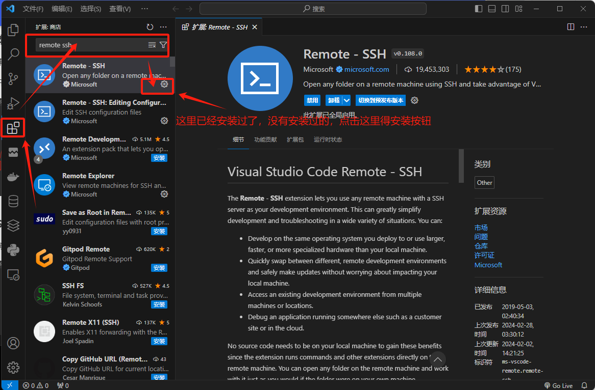
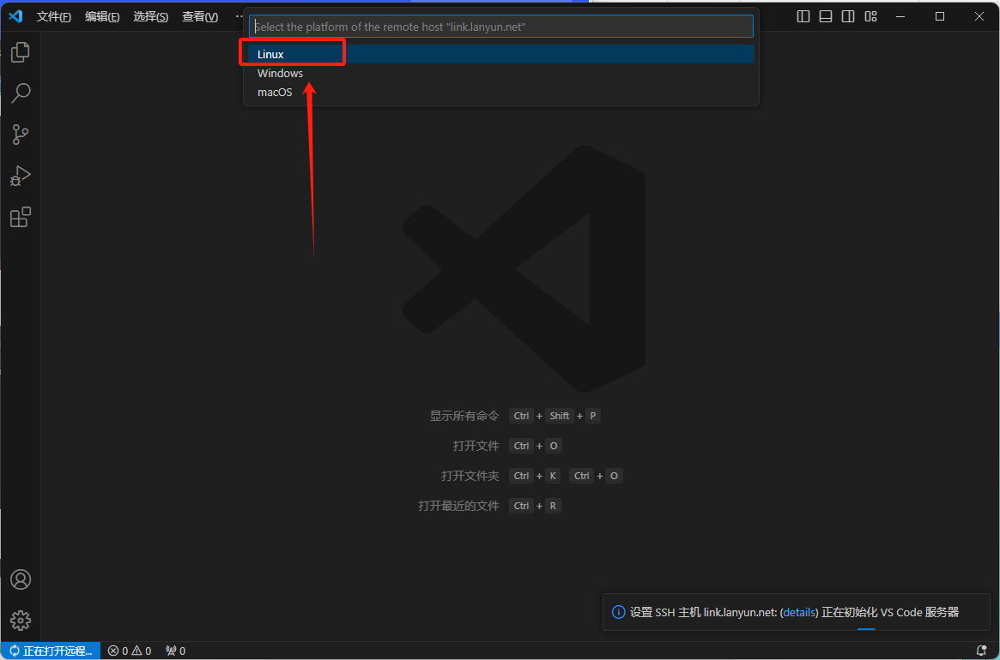
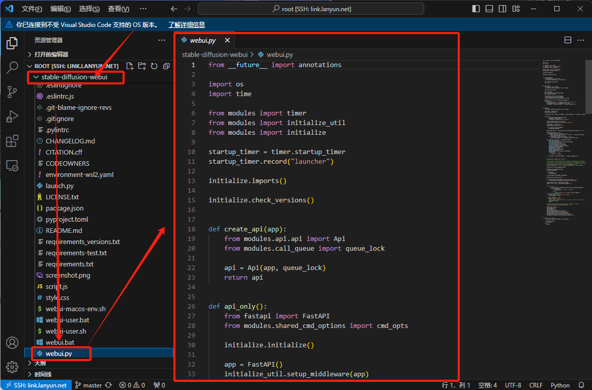
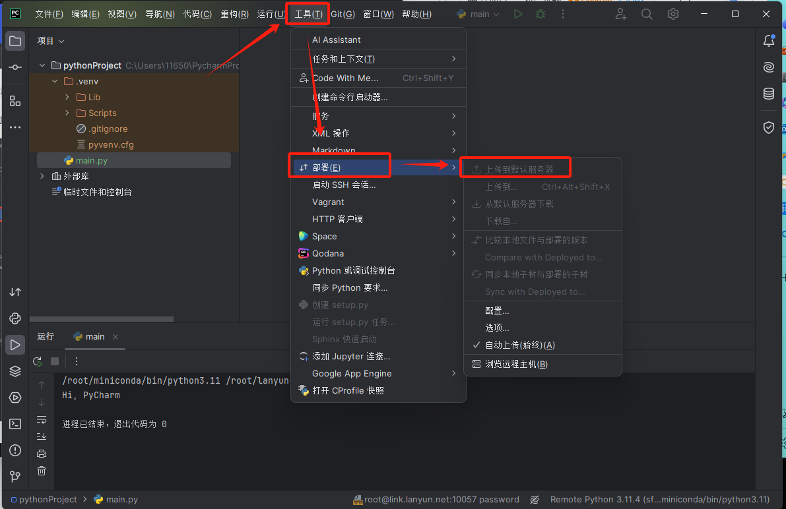

# 7 使用案例

## **7.1 lightgbm**

安装依赖：

```elm
 apt-get update
 apt-get install build-essential
 apt-get install cmake
 apt-get install libomp-dev
```

安装lightgbm：
```elm
 pip install lightgbm
```

编写测试demo:

```elm
import lightgbm as lgb
import numpy as np

X_train = np.array([[1, 2, 3], [4, 5, 6], [7, 8, 9]])
y_train = np.array([0, 1, 0])
train_data = lgb.Dataset(X_train, label=y_train)

params = {
    'boosting_type': 'gbdt',
    'objective': 'binary',
    'metric': 'binary_logloss',
    'num_leaves': 31,
    'learning_rate': 0.05,
    'feature_fraction': 0.9
}

num_rounds = 100
model = lgb.train(params, train_data, num_rounds)

X_test = np.array([[1, 2, 3], [4, 5, 6]])
y_pred = model.predict(X_test)

print("OUT PUT RESULT:", y_pred)
```

执行


## **7.2 字体配置说明**

安装 fontconfig
fontconfig 是一个常用的字体配置和管理工具集，它提供了包括 fc-list 在内的多个命令行工具。

```elm

apt update 
apt-get install -y fontconfig

```

 清除 Matplotlib 字体缓存
 Matplotlib 维护了一个字体列表的缓存，以加快启动速度。如果安装了新字体而没有更新缓存，可能需要清除缓存，方法是删除 ~/.cache/matplotlib/ 目录内容：
 ```elm
rm -rf .cache/matplotlib/
```

上传所需字体到操作系统
```elm
root@a193ab13b570:~# ls
STXINGKA.TTF  SimHei.ttf
```

 将字体移动到系统指定目录下
```elm
root@a193ab13b570:~# mkdir /usr/share/fonts/truetype/noto
root@a193ab13b570:~# mv STXINGKA.TTF SimHei.ttf /usr/share/fonts/truetype/noto
```
更新字体缓存
这将强制重新扫描系统中所有字体的路径，并更新字体缓存。-f 选项表示强制更新，而 -v 选项表示显示详细信息。
```elm
fc-cache -fv
```
 使用 fc-list 命令来确认 SimHei 字体是否被正确识别
 如果 SimHei 出现在输出列表中，那么它应当已经可用于系统和应用程序，包括 Matplotlib。
 ```elm
fc-list | grep -i simhei
root@a193ab13b570:~# fc-list | grep -i STXINGKA
/usr/share/fonts/truetype/noto/STXINGKA.TTF: STXingkai,华文行楷:style=Regular
root@a193ab13b570:~# fc-list | grep -i simhei
/usr/share/fonts/truetype/noto/SimHei.ttf: SimHei,黑体:style=Regular,Normal,obyčejné,Standard,Κανονικά,Normaali,Normál,Normale,Standaard,Normalny,Обычный,Normálne,Navadno,Arrunta
```
 重启ipymb内核
 Matplotlib 会缓存字体列表来加快启动速度，如果这个缓存没有更新，就可能导致找不到新安装的字体。
 在更改系统级配置如字体安装之后，通常需要重新启动 Jupyter 内核。
 重新运行ipymb里的python代码
 查看新的缓存文件，可以看到新字体STXINGKA和SimHei已加载。
```elm

root@a193ab13b570:# cd ~/.cache/matplotlib

root@a193ab13b570:~/.cache/matplotlib# grep -i STXINGKA fontlist-v330.json 
      "fname": "/usr/share/fonts/truetype/noto/STXINGKA.TTF",
      "name": "STXingkai",
root@a193ab13b570:~/.cache/


root@a193ab13b570:~/.cache/matplotlib# grep -i SimHei fontlist-v330.json 
      "fname": "/usr/share/fonts/truetype/noto/SimHei.ttf",
      "name": "SimHei",
```

## **7.3 压缩 / 解压** 

>建议在没有特别需求的情况下，优先选择使用`.tar`格式进行打包。这是因为`.tar`格式只会将文件集合起来打包而不会执行压缩操作，而对于图片和视频这类已经高度压缩过的文件来说，进一步压缩很难达到更小的体积。使用`.tar`格式可以实现快速打包和解包，同时也减少了资源消耗。

为了解压缩不同格式的文件，您通常需要安装相应的软件包。以下是针对`zip`, `tar`, 和 `rar` 文件格式的解压命令以及所需的软件包：

```elm
# zip
apt-get install unzip zip
 
# tar
apt-get install tar

# rar
apt-get install unrar rar

# 7z
apt-get install p7zip-full
```

### 7.3.1 压缩zip和解压zip

```
# 压缩。
zip -r <自定义压缩包名称>.zip <待压缩目录的路径>

# 解压。
unzip  <待解压压缩包名称>.zip -d <解压到哪个路径>
```

### 7.3.2 压缩tar和解压tar

```
# 压缩（推荐使用打包而非压缩的方法来处理文件，尤其适用于图片等本身已经压缩的文件类型。这样做可以节省压缩和解压的时间，因为这些文件类型不太可能通过压缩进一步减小体积。）
tar cvf <自定义压缩包名称>.tar <待压缩目录的路径>

# 解压
tar xf <待解压压缩包名称>.tar -C <解压到哪个路径>
```

### 7.3.3 压缩tar.gz和解压tar.gz

```
# 压缩
tar cvzf <自定义压缩包名称>.tar <待压缩目录的路径>

# 解压
tar xf <待解压压缩包名称>.tar -C <解压到哪个路径>
```

### 7.3.4 解压rar

```
# 解压
unrar e <待解压压缩包名称>.rar
```

### 7.3.5 解压7z

```
# 解压
7z x archive.7z
```

## **7.4 VSCode远程开发** 

> 请注意，当您在VSCode中直接运行或通过终端启动训练程序时，在调试完成并确保一切正常后，建议使用`screen`或`tmux`等工具来开启一个守护进程。这样做可以保证训练程序在SSH连接断开后仍然持续运行，不会受到影响。

参考官方文档，请点击[此处](http://165.154.163.28:3002/#)。

关于Lanyun的使用方法，您需要先完成以下准备工作：

1. 确保已在本地计算机上安装了VSCode。
2. 在Lanyun平台租用并启动一个实例，记录下提供的SSH登录凭据（包括登录指令和密码）。
3. 在VSCode中安装Remote Development插件，并配置好Remote-SSH相关设置。

### 7.4.1.登录Lanyun选择开机的实例

确保您已经获取了SSH登录所需的信息。


### 7.4.2.本地VSCode配置Remote-SSH

如果您的本地VSCode已经安装了Remote-SSH扩展，您可以忽略这一步骤并直接前往[步骤3]。

否则，请打开VSCode，进入扩展市场，搜索并安装Remote-SSH插件。




### 7.4.3.SSH连接并登录您远端租用的实例

依照指引进行操作，点击相应的界面元素以完成SSH主机的添加。


复制Lanyun平台，获取您实例提供的SSH登录信息。

以命令 `ssh -p 10057 root@link.lanyun.net` 为例，执行后按回车键继续。请注意，确认命令末尾没有多余的空格，否则可能会导致无法成功登录。


按回车键后，可能会出现自定义SSH config文件的提示。通常无需自定义，所以直接再次按回车键即可。随后可能会弹出询问远程服务器操作系统类型的选项，这时请选择“Linux”。




在提示框中输入密码并等待SSH登录过程完成。


连接成功。


### 7.4.4.选择您的代码目录

根据示例，代码已成功上传至实例的指定目录。如果您尚未上传资源，可以参考使用SCP进行远程文件拷贝或查阅JupyterLab相关章节的内容来上传代码。



**建议：当您使用VSCode进行代码开发时，根据所选编程语言，配置适当的解释器以优化开发体验。**


### 7.4.5 PyCharm远程开发

> 请注意，当您在PyCharm中直接运行或通过终端启动训练程序时，在调试完成并确保一切正常后，建议使用`screen`或`tmux`等工具来开启一个守护进程。这样做可以保证训练程序在SSH连接断开后仍然持续运行，不会受到影响。

### 7.4.6 远程项目开发

请点击此处查阅[官方文档](https://www.jetbrains.com/help/pycharm/configuring-remote-interpreters-via-ssh.html)。

关于Lanyun的使用方法，可按照以下步骤操作：

**步骤1:** 确认您的PyCharm版本。远程开发特性仅在PyCharm的专业版中可用。

**步骤2:** 启动您的实例，并复制SSH登录命令。例如：`ssh -p 10057 root@link.lanyun.net`。这个命令中的参数意义如下：

- 用户名：`root`
- 主机地址（HOST）：`link.lanyun.net`
- 端口号：`10057`

**步餐3:** 在PyCharm中进行配置。

导航至「文件」-> 「设置」，打开设置弹窗，在其中搜索「项目」，找到「Python 解释器」的设置项。


点击「添加解释器」，然后选择「SSH 」的选项进行添加（请注意，PyCharm社区版不包含此选项）。


在相应的字段中填入您实例SSH命令的Host、Port和Username（通常Username为`root`；Host和Port信息则根据您实例的SSH指令确定）。


接下来，输入您的SSH连接密码。


下一步


继续下一步，在此选择「系统解释器」，并将远程Python解释器的路径设置为`/root/miniconda/bin/python3.11`（如果使用了其他版本的Python或配置了虚拟环境，请按照实际情况进行设置）。

同时，设置项目的同步目录以关联本地项目和远程实例中的相应目录。建议将其设置为实例的数据盘目录：`/root/lanyun-tmp/project/`（通常不推荐使用默认的`/tmp`目录）。


点击「创建」以完成配置。如果所有设置都正确，PyCharm将花费一点时间来完成初始化。一旦完成，您就可以开始远程开发了。

如果在尝试运行程序时发现Python文件缺失，这可能意味着代码尚未自动同步到远程服务器。在这种情况下，您可以选择手工进行同步：



### 7.4.7 打开远程终端

一旦远程开发环境在PyCharm中配置完成，您可以通过下拉PyCharm终端菜单选择并打开连接到远程服务器的终端会话。


连接上远程服务器


### 7.4.8 运行python代码

编写完Python代码后，等待PyCharm自动将代码同步到远程服务器上，接着即可执行运行代码的操作。


执行代码时，您会注意到正在使用的Python解释器位于远程服务器上。

