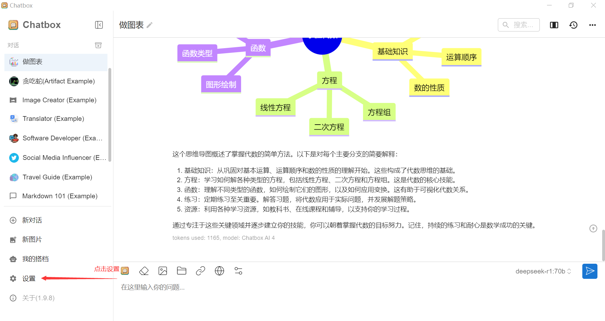
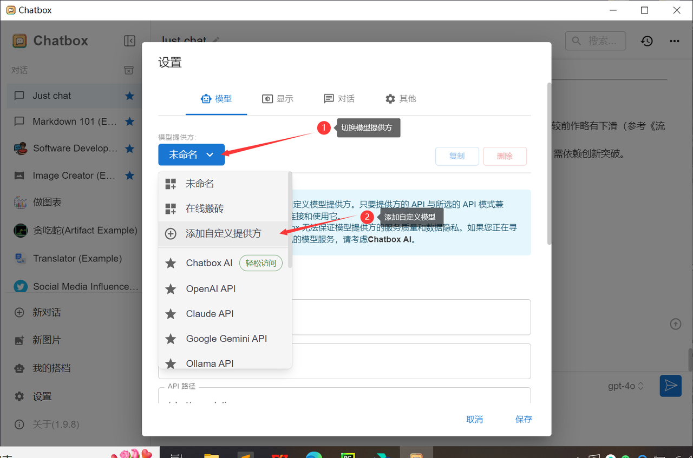
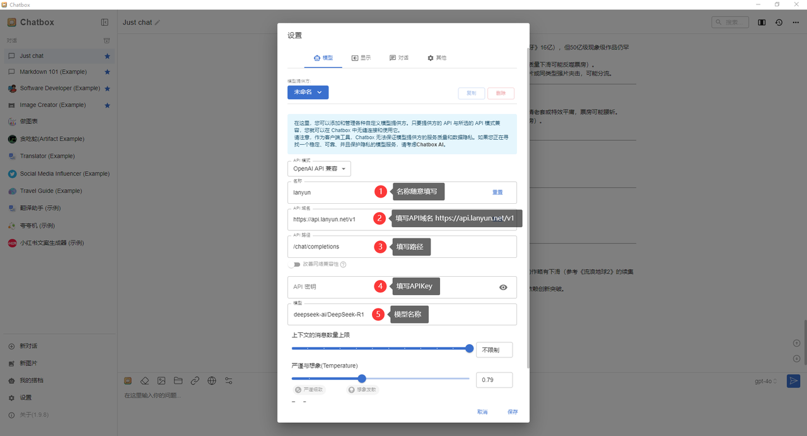
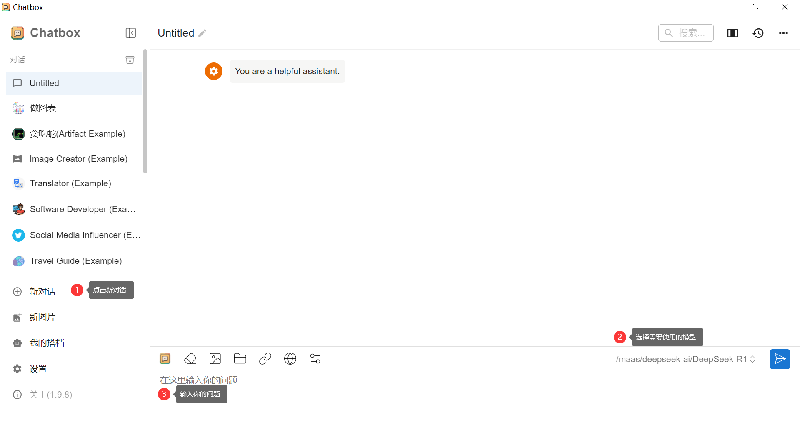

# MaaS平台操作手册

## 产品简介

### 什么是MaaS平台？

模型即服务（MaaS）平台面向企业开发者、创业者及非技术背景用户，提供开箱即用的热门AI模型服务，支持零代码体验、API快速集成与灵活计费，降低AI应用开发门槛，加速业务创新。允许用户通过API接口或其他方式访问和使用预先训练好的机器学习模型，无需自己从头开始训练模型，使得即使没有深厚机器学习背景的用户也能享受到高水平的AI技术支持。

### MaaS平台的典型特点包括：

- 模型多样性：提供多种类型的机器学习模型，适应不同的业务需求；
- 易用性：用户通过简单API调用或对话框即可使用模型；
- 可扩展性：能够根据业务的发展需求，快速扩展或更新模型服务；
- 性能保障：平台通常提供高性能计算资源，确保模型运行的效率和稳定性；
- 数据隐私与安全：保障用户数据在使用过程中的安全性和隐私性。

MaaS平台正在成为越来越多企业和开发者首选的AI解决方案，尤其适用于那些需要快速迭代和灵活应用AI技术的场景。

### 支持的大模型

API BaseUrl: https://maas-api.lanyun.net/v1/chat/completions

| 模型 | API 调用模型名 | 免费赠送token | 单价（元/百万token） | 支持上下文长度 | 输入 token 上限 | 输出 token 上限 |
| --- | --- | --- | --- | --- | --- | --- |
| DeepSeek-R1 | /maas/deepseek-ai/DeepSeek-R1 | 5百万 | 8.00 元 | 60K | 65536 | 9536 |
| DeepSeek-V3 | /maas/deepseek-ai/DeepSeek-V3 | 5百万 | 4.00 元 | 60K | 65536 | 9536 |
| QwQ-32B | /maas/qwen/QwQ-32B | 1百万 | 4.00 元 | 40K | 40960 | 9536 |

`Token是指模型处理和生成文本时的基本单元，中文的Token通常是一个字或词，英文的Token通常是一个单词、子词或词组。`

除了上述文生文的deepseek，Maas平台还支持图像理解与生成、音视频理解与生成、数学领域、法律领域等方面的大模型。平台后续将纳管众多主流的第三方大模型，例如Llama、ChatGLM、零一万物、Stable Diffusion等大模型，敬请期待。

## 快速入门

本文帮助您了解并按照步骤完成 API 调用模型，包括如何配置环境，使用 SDK 调用模型服务，便于您了解如何通过代码使用模型能力，进而集成到您的工作或者应用中。

### 步骤1：登录注册

注册并登录蓝耘元生代智算云平台。

### 步骤2：接入 API

1. 根据需要，使用APIKEY调用对应的接口，即可开始使用。
2. 使用后，可进入资源包管理，选择接口查看使用情况。

## OpenAI兼容接口

直接使用 OpenAI 官方提供的 SDK 来调用大模型对话接口。您仅需要将 base_url 和 api_key 替换成相关配置，不需要对应用做额外修改，即可无缝将您的应用切换到相应的大模型。

```
base_url:https://maas-api.lanyun.net/v1
api_key：如需获取请参考获取API KEY
接口完整路径：https://maas-api.lanyun.net/v1/chat/completions
```

### python

创建一个python文件命名为ark_example.py，将下面示例代码拷贝进文件。并替换密钥为您的API KEY。替换content中的 `你是`谁为您想要的提问内容。点击运行，稍等您可以在终端窗口中看到模型调用的返回结果。这样您就完成了您的首次型服务调用。

```python
from openai import OpenAI

# 构造 client
client = OpenAI(
    api_key="sk-xxxxxxxxxxx",  # APIKey
    base_url="https://maas-api.lanyun.net/v1",
)
# 流式
stream = True
# 请求
chat_completion = client.chat.completions.create(
    model="/maas/deepseek-ai/DeepSeek-R1",
    messages=[
        {
            "role": "user",
            "content": "你是谁",
        }
    ],
    stream=stream,
)
if stream:
    for chunk in chat_completion:
        # 打印思维链内容
        if hasattr(chunk.choices[0].delta, 'reasoning_content'):
            print(f"{chunk.choices[0].delta.reasoning_content}", end="")
        # 打印模型最终返回的content
        if hasattr(chunk.choices[0].delta, 'content'):
            if chunk.choices[0].delta.content != None and len(chunk.choices[0].delta.content) != 0:
                print(chunk.choices[0].delta.content, end="")
else:
    result = chat_completion.choices[0].message.content
```

### NodeJS

```js
const OpenAI = require("openai");

// 构造 client
const client = new OpenAI({
    apiKey: "sk-xxxxxxxxxxx", //  APIKey
    baseURL: "https://maas-api.lanyun.net/v1/chat/completions", 
});

// 定义一个异步函数来处理请求
async function getCompletion() {
    try {
        const completion = await client.chat.completions.create({
            model: '/maas/deepseek-ai/DeepSeek-R1',
            messages: [{ role: 'user', content: '你好' }],
            stream: true, 
        });

        // 处理流式响应
        for await (const chunk of completion) {
            if (chunk.choices) {
                // 打印思维链内容
                console.log("reasoning_content:", chunk.choices[0]?.delta?.reasoning_content);
                // 打印模型最终返回的content
                console.log("content", chunk.choices[0]?.delta?.content);
            }
        }
    } catch (error) {
        console.error("Error occurred:", error);
    }
}

// 调用异步函数
getCompletion();
```

### cURL

您可以通过 HTTP 方式直接调用模型服务。在终端窗口中，拷贝下面命令，并替换密钥为您的API KEY。替换content中的`你好`为您想要的提问内容。稍等您可以在终端窗口中看到模型调用的返回结果。这样您就完成了您的首次型服务调用

```shell
curl https://maas-api.lanyun.net/v1/chat/completions \
-H "Content-Type: application/json" \
-H "Authorization: Bearer sk-xxxxxxxxxxx" \
-d '{
  "model": "/maas/deepseek-ai/DeepSeek-R1",
  "messages": [
        {
            "role": "user",
            "content": "你好"
        }
    ],
  "stream": true
}'
```

## 获取 API Key

1. 进入 API平台 > 立即接入 管理，单击**创建 API KEY**。
2. 单击创建 API Key 按钮。
3. 在弹出框的名称文本框中确认/更改 API Key 名称，单击创建。

   **说明: 请妥善保存好API Key，强烈建议您不要将其直接写入到调用模型的代码中**

4. 创建完成后，进入 API KEY 管理，进行新增、查看、删除操作。

## 资源包管理

平台为每一个用户提供了免费的5,000,000 tokens，在资源包管理查看剩余量以及使用量。

## 与chatbox工具搭配使用

1. 获取  API KEY，在API KEY管理复制出来
2. 下载 Chatbox，官网戳这里https://chatboxai.app/zh，支持Win/Mac/iOS/安卓/网页版
3. 配置 Chatbox，以 Windows 版为例

a. 打开 Chatbox，进入设置





**1.名称**（随便填，比如可以是 lanyun，方便区分)

**2.API 地址**：https://maas-api.lanyun.net

**3.API 路径**：/v1/chat/completions

**4.API 密钥**：填写刚刚复制的APIKEY

**5.填写模型名称**，比如/maas/deepseek-ai/DeepSeek-R1

**6.点击保存**

**7.创建对话**，确认要使用的模型，开始聊天吧

